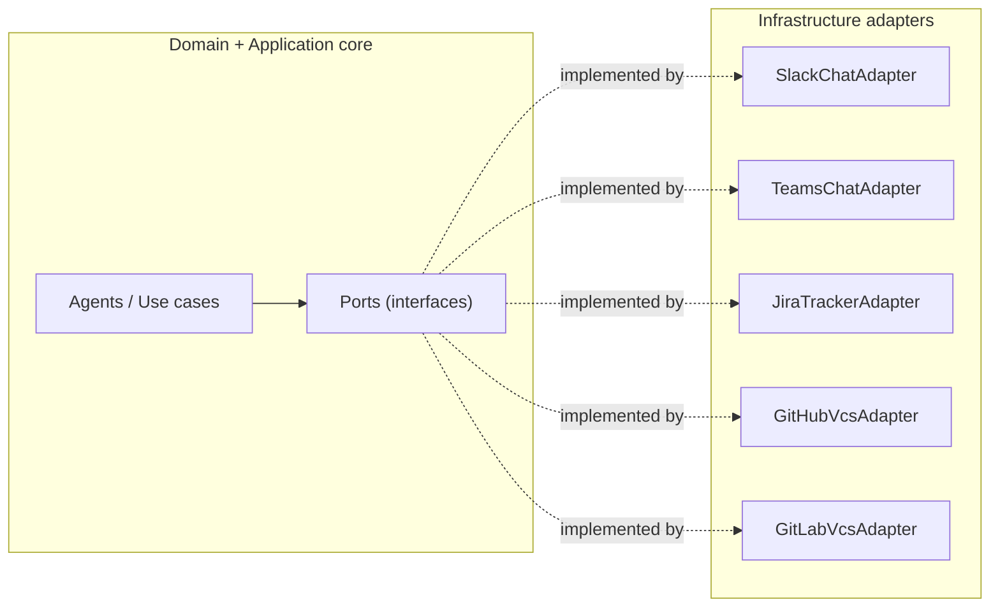

# PulseOps — Architecture

Architecture and engineering standards for the PulseOps agentic program-management system. For the product concept and phased roadmap, see [PulseOpsConcept.md](PulseOpsConcept.md).

---

## 1. Guiding Principles

1. **Clean / hexagonal architecture.** The domain is pure. Dependencies point inward. The core never knows about a vendor SDK, a database, or HTTP.
2. **Everything external is a port.** Every external system (chat, issue tracker, VCS, CI, calendar, LLM, storage) is accessed through an interface so that providers like Slack and Teams are swappable via configuration.
3. **Loose coupling, high cohesion.** Small, focused interfaces; vendor specifics isolated at the edges behind an anti-corruption layer.
4. **Explainable and auditable.** Every status traces to source facts; every agent action is logged, idempotent, and reversible.

> SSO/identity is intentionally deferred for the initial build. Access control will be layered in later (see [PulseOpsConcept.md](PulseOpsConcept.md) Epic 0.2) without changing the core architecture.

---

## 2. Tech Stack

| Layer | Choice |
|---|---|
| Backend language | Python 3.12 |
| API | FastAPI + Pydantic v2 |
| Agents / orchestration | LangGraph (multi-agent graph) |
| LLM gateway | LiteLLM (provider-agnostic) |
| Workflow engine | Temporal (durable, scheduled, long-running check-ins/nudges/escalations) |
| System of record | PostgreSQL |
| Graph queries | PostgreSQL + Apache AGE |
| Time-series | TimescaleDB (Postgres extension) |
| Vector / semantic search | pgvector (Postgres extension) |
| Cache / queues / rate-limit state | Redis |
| Frontend | React + TypeScript + Vite |
| UI | shadcn/ui + Tailwind CSS |
| Charts / viz | ECharts + React Flow |
| LLM tracing | Langfuse |
| Observability | OpenTelemetry + Grafana/Prometheus |

One Postgres instance (with AGE + Timescale + pgvector) covers graph, time-series, and vector needs to start. Dedicated stores (e.g. Neo4j) are deferred until scale justifies them.

---

## 3. Layered Architecture (Hexagonal)



**Dependency rule:** `api -> application -> domain`, and `infra -> ports`. Arrows point inward. The domain depends on nothing external.

- **Domain** — entities, value objects, domain rules. No I/O, no SDKs, no FastAPI, no SQL.
- **Application** — use cases and agents (LangGraph nodes); orchestrates work through ports.
- **Ports** — interfaces (`Protocol`/ABC) the core depends on.
- **Infrastructure** — adapters implementing ports (vendors, persistence, Temporal workflows).
- **API** — FastAPI routers, request/response DTOs, dependency wiring.

---

## 4. Project Layout

```
backend/
  core/
    domain/          # entities, value objects, domain rules. NO external imports.
    application/     # use cases, agents (LangGraph nodes), orchestration
    ports/           # Protocol/ABC interfaces (chat, tracker, vcs, repos, llm)
  infra/
    adapters/        # slack/, teams/, jira/, github/, gitlab/, ci/
    persistence/     # postgres (AGE/Timescale/pgvector) repo implementations
    workflows/       # Temporal workflows & activities
    registry.py      # config -> adapter wiring (DI composition root)
  api/               # FastAPI routers, request/response DTOs, dependencies
  config/            # pydantic-settings
  tests/             # unit/, contract/, integration/
frontend/            # React/Vite, feature-based
```

---

## 5. Provider Abstraction (Ports & Adapters)

The core never imports a vendor SDK. It depends only on **ports**. Each vendor is an **adapter** implementing a port, wired in at startup via config. Adding a new provider is a new adapter file plus a config value, with zero core changes.

There is **one port per capability** (not per vendor):

| Port | Capability | Example adapters |
|---|---|---|
| `ChatProvider` | DM/threaded conversation | Slack, Teams |
| `IssueTracker` | issues, transitions, comments | Jira |
| `VcsProvider` | repos, commits, PRs | GitHub, GitLab |
| `CiProvider` | build/pipeline results | GitHub Actions, Jenkins |
| `CalendarProvider` | availability, PTO, timezone | Microsoft Graph, Google |
| `LlmProvider` | model calls | LiteLLM-backed |
| `GraphRepository` / `TimeSeriesRepository` / `VectorStore` | persistence | Postgres (AGE/Timescale/pgvector) |

### Example port

```python
# core/ports/chat.py — the core depends ONLY on this
from typing import Protocol
from core.domain.messaging import OutboundMessage, InboundMessage, ChatUserRef

class ChatProvider(Protocol):
    async def send_dm(self, user: ChatUserRef, message: OutboundMessage) -> str: ...
    async def open_thread(self, user: ChatUserRef) -> str: ...
    async def fetch_reply(self, thread_id: str) -> InboundMessage | None: ...
```

```python
# core/ports/issue_tracker.py
class IssueTracker(Protocol):
    async def get_issue(self, key: str) -> Issue: ...
    async def list_active_for(self, assignee: UserRef) -> list[Issue]: ...
    async def transition(self, key: str, to_state: str) -> None: ...
    async def add_comment(self, key: str, body: str) -> None: ...
```

### Example adapter (anti-corruption layer)

```python
# infra/adapters/chat/slack_adapter.py
class SlackChatAdapter:  # structurally satisfies ChatProvider
    def __init__(self, client: AsyncWebClient) -> None:
        self._client = client

    async def send_dm(self, user: ChatUserRef, message: OutboundMessage) -> str:
        resp = await self._client.chat_postMessage(
            channel=user.external_id, text=message.text
        )
        return resp["ts"]
    # ...maps Slack payloads -> domain InboundMessage
```

### Config-driven selection (composition root)

```python
# infra/registry.py
CHAT_ADAPTERS = {"slack": build_slack_adapter, "teams": build_teams_adapter}

def get_chat_provider(settings: Settings) -> ChatProvider:
    return CHAT_ADAPTERS[settings.chat_provider](settings)
```

Rule of thumb: if a vendor name (e.g. `Slack`) appears outside `infra/adapters/slack/`, it is a bug. Each port has a shared **contract test suite** that every adapter must pass.

---

## 6. Coding Standards

### Architecture & design
- **Hexagonal layering.** Domain is pure (no I/O, SDKs, FastAPI, or SQL). Application orchestrates via ports. Infra implements ports. Enforce with import-linter so violations fail CI.
- **Dependency inversion everywhere.** Core depends on `ports`, never on concrete adapters. Adapters are injected at the composition root via constructor injection. No globals or singletons reached into.
- **One port per capability, vendor-agnostic.** No vendor name in a port or any core symbol.
- **SOLID**, emphasizing Single Responsibility (one reason to change) and Interface Segregation (small, focused ports).
- **Anti-corruption layer.** Adapters translate vendor payloads to domain models at the boundary; vendor types never leak inward.
- **DTOs vs entities.** Pydantic models at API/adapter boundaries; plain domain objects (dataclasses) for domain logic. Do not reuse one model across all layers.

### Typing & language
- **Full type hints**; `mypy --strict` (or `pyright` strict). `Any` is banned except at unavoidable SDK seams, isolated there.
- **Ports as `typing.Protocol`** (structural) so adapters need not inherit; use ABCs only when shared behavior is required.
- **Async-first** for all I/O (`httpx.AsyncClient`, async DB drivers). Never block the event loop.
- **Immutability** by default: frozen dataclasses / `model_config(frozen=True)` for value objects.

### Errors, logging, observability
- **Domain exceptions** (e.g. `BlockerNotFound`, `ProviderUnavailable`). Adapters catch vendor errors and re-raise as domain/port errors; a vendor SDK exception must never surface in a use case.
- **Structured logging** (`structlog`) with correlation/trace IDs. Never log PII or the contents of developer DMs.
- **OpenTelemetry** spans across agent steps; **Langfuse** traces on every LLM call (prompt, tokens, cost, latency).
- **Idempotency + audit** for any agent write (Jira transitions, nudges): every external mutation is logged, reversible, and safe to retry. Temporal activities must be idempotent.

### Configuration & secrets
- **`pydantic-settings`**, 12-factor, env-driven. No secrets in code or VCS. Provider selection (e.g. `chat_provider=slack`) lives in config.
- Per-environment config; fail fast on missing required settings at boot.

### Testing
- **Test pyramid.** Domain/application = fast pure unit tests (no I/O). Adapters = **contract tests** against the port (one shared suite run for every provider). Integration tests use Testcontainers (Postgres) and recorded HTTP (`respx`/VCR).
- **Fakes over mocks.** Prefer in-memory fakes (`FakeChatProvider`, `InMemoryGraphRepository`); tests stay readable and decoupled from mock call-order.
- Coverage gate on `core/` (target 85%+). Deterministic; no network in unit tests.

### Style, format, tooling
- **`ruff`** (lint + import sort) and **`ruff format`** (Black-compatible), enforced in pre-commit and CI.
- **Naming:** modules/functions `snake_case`, classes `PascalCase`, constants `UPPER_SNAKE`. Ports named by capability (`ChatProvider`); adapters by vendor + capability (`SlackChatAdapter`).
- **Small units:** functions do one thing; keep cyclomatic complexity low (ruff `C901`). No comments that narrate code; comments only for non-obvious intent.
- **Conventional Commits** and small, focused PRs that reference the epic/story.

### Frontend standards
- **Feature-based folders**, TypeScript `strict`, ESLint + Prettier.
- **Typed API client** generated from FastAPI's OpenAPI spec — a single source of truth for contracts.
- **TanStack Query** for all server state (no ad-hoc fetching in components). Presentational vs container component separation. shadcn/ui + Tailwind tokens; no inline magic colors.
- Charts isolated behind small wrapper components so ECharts can be swapped without touching feature code (the same port philosophy on the front end).
