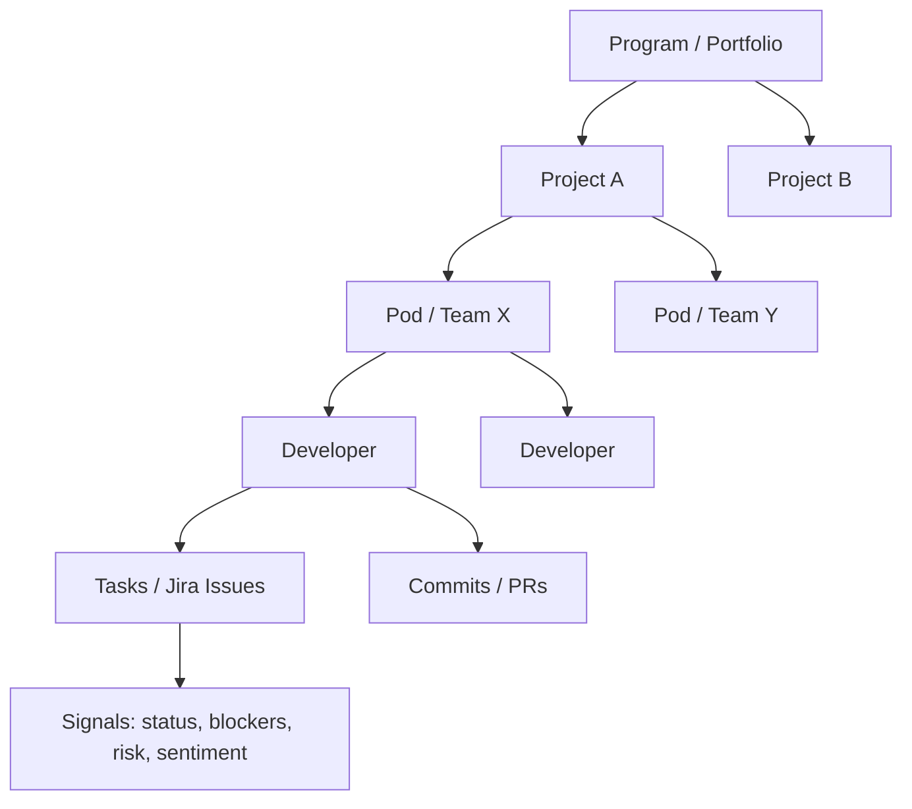
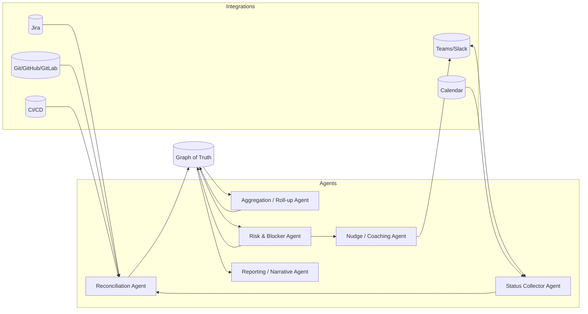

# Agentic Program Management System — "OpenProgram"

Here's a complete conceptualization. I've organized it as: the core idea, the agent architecture, the data model (your single source of truth), the daily flow, the persona-specific views, and a set of high-value extra capabilities. No files created — this is all in-chat for you to react to.

---

## 1. Core Idea

A **multi-agent system** that treats project status as a *continuously maintained, automatically reconciled* dataset rather than something humans assemble in meetings.

Three principles:

1. **One canonical state, many views.** A single graph of truth (dev → pod/team → project → program) that every persona reads through a different lens.
2. **Pull from humans, reconcile with systems.** Agents proactively ask developers for qualitative status, then cross-check it against "hard signals" from Jira/Git/CI so the picture is honest, not optimistic.
3. **Roll-up is automatic and explainable.** Every higher-level status is derived from lower-level facts, and you can always drill from a red program indicator down to the exact blocker on one dev's task.

---

## 2. The Entity Hierarchy (Single Source of Truth)

Key design point: **a developer can belong to multiple pods, and a pod maps to one or more projects.** The mapping layer (`dev ↔ pod ↔ project`) is itself first-class data, so re-orgs and matrixed teams don't break reporting. Status always aggregates *along whatever mapping is active for a given date*.

---

## 3. Agent Architecture

A coordinator orchestrates specialized agents, each with a narrow job:

**The agents:**

| Agent | Responsibility |
|---|---|
| **Status Collector** | Proactively DMs each dev (Teams/Slack) at their preferred time. Conversational, not a form. Adapts questions to context ("You moved PROJ-412 to In Progress yesterday — done or still going?"). |
| **Reconciliation** | Compares what the dev *said* against Jira transitions, commits, PR activity, CI results. Flags drift ("dev says done, but no PR merged"). Produces a *confidence-scored* status. |
| **Aggregation / Roll-up** | Derives pod status from dev statuses, project status from pods, program from projects. Uses weighted rules (blockers, critical-path tasks, sprint scope) not just averages. |
| **Risk & Blocker** | Detects stale tasks, repeated blockers, dependency stalls, scope creep, slipping milestones. Predicts likely sprint/milestone misses. |
| **Reporting / Narrative** | Generates human-readable updates per level on demand or on schedule (daily pod summary, weekly project update, exec brief). |
| **Nudge / Coaching** | Gentle follow-ups: reminds devs who haven't responded, escalates unresolved blockers to scrum master, suggests reallocations to managers. |

---

## 4. The Daily Status Flow (the heart of it)

This is what makes it *agentic* rather than a dashboard:

1. **Proactive ask** — At each dev's chosen time (respecting calendar, PTO, timezone), the Status Collector opens a short conversation in Teams:
    - "Morning! Quick check-in 👋 What did you wrap up since yesterday? Anything blocking you? How are you feeling about your sprint commitments?"
    - It pre-fills context so the dev mostly confirms/corrects rather than types from scratch.
2. **Conversational, low-friction** — Dev can reply in one line or in detail. Agent parses free text into structured signals (progress %, blockers, mood, ETA changes).
3. **Auto-update systems** — With permission, the agent updates Jira (transitions, comments, remaining estimate) so the dev's *answer* keeps the board accurate — eliminating double entry.
4. **Reconcile** — Cross-checks against git/CI. If the dev said "almost done" but the PR has 40 unresolved review comments, that nuance feeds the risk model.
5. **Roll-up** — Pod and project statuses recompute. A new blocker on a critical-path task immediately turns the project's risk indicator amber and notifies the scrum master.
6. **Summarize** — End-of-day pod summary and any escalations are generated automatically.

**Non-response handling:** if a dev doesn't reply, the agent nudges once, then marks status as "stale/unknown" (never silently assumes green), and falls back to inferring from git/Jira signals with a lowered confidence score.

---

## 5. Persona Views

Same data, five lenses. Each view answers "what do *I* need to act on?"

### Developer view
- My tasks, my blockers, my sprint burndown, my upcoming deadlines.
- "Focus list" — agent-prioritized: what to work on next and why.
- Lightweight; mostly consumed *inside the chat conversation*, not a heavy dashboard.

### Product Owner view
- Backlog health, scope vs. capacity, feature/epic progress, release readiness.
- "Will we ship Epic X by the target date?" with confidence + the risks behind it.
- Stakeholder-ready feature status without pinging the team.

### Scrum Master view
- **Blocker board** — every active blocker, age, owner, escalation state.
- Sprint health, flow metrics (cycle time, WIP, throughput), standup-ready digest.
- Who hasn't checked in, where reconciliation found drift, team load balance.

### Manager view
- Pod/team-level health across multiple projects, capacity & utilization, at-risk people (burnout signals), cross-team dependencies.
- Trend lines: is this team improving or sliding?

### Higher Management / Exec view
- Portfolio heatmap: every program/project as red/amber/green with one-line "why."
- Milestone & OKR tracking, budget/timeline confidence, top 5 risks across the org.
- Auto-generated narrative brief ("This week across the portfolio…"), drillable to source.

---

## 6. Visualization Concepts

- **Portfolio heatmap** (exec): grid of projects colored by derived health, click to drill.
- **Hierarchy tree / sunburst**: program → project → pod → dev, each node colored, expandable.
- **Sprint & release burndown/burnup** per pod and project.
- **Flow / cumulative flow diagrams**: WIP, bottlenecks, cycle time.
- **Dependency graph**: cross-team/task dependencies with stalled links highlighted.
- **Blocker timeline**: blockers over time, time-to-resolution.
- **Confidence overlay**: every status shows how much is human-confirmed vs. inferred — so leaders know how much to trust green.
- **Trend sparklines** on every card for momentum at a glance.

> Implementation note: I'd build these as an interactive Cursor canvas (live React) when you want to actually see them — just say the word and I'll render a working prototype dashboard.

---

## 7. Additional High-Value Functionalities

Beyond your stated requirements, these make the system genuinely useful:

**Risk & prediction**
- **Milestone slip prediction** — forecast sprint/release miss probability from current velocity, scope, and blocker trends.
- **Dependency-stall detection** — flag when Team A is blocked waiting on Team B *before* it becomes a fire.
- **Scope-creep alerts** — detect mid-sprint scope additions and their schedule impact.

**People & health**
- **Burnout / overload signals** — sustained overtime patterns, after-hours commits, declining sentiment in check-ins (privacy-respecting, surfaced to managers as aggregate signals, not surveillance).
- **Sentiment tracking** — morale trend per pod from check-in tone, early warning of team friction.
- **Load balancing suggestions** — recommend reassignments when one dev is overloaded and another has slack.

**Automation & reporting**
- **Auto-generated standup notes & retro inputs** — the agent walks into standup with the summary already done; feeds retros with data ("blockers took avg 3.2 days this sprint").
- **Stakeholder updates on demand** — "Give me a 5-line update on Project B for the client" → instant, accurate, sourced.
- **Meeting reduction** — async status means fewer status meetings; the agent *is* the standup for distributed teams.

**Integrity & trust**
- **Drift detection** — continuous reconciliation between stated and actual progress; surfaces "watermelon" projects (green outside, red inside).
- **Explainability / audit trail** — every roll-up traces to source facts; every agent action (Jira edits, nudges) is logged and reversible.

**Knowledge & continuity**
- **Decision & blocker memory** — institutional memory of how past blockers were resolved; suggests resolutions for recurring ones.
- **Onboarding context** — new joiners get an agent-generated map of their pod, projects, and current state.

**Operational**
- **Smart escalation policies** — blocker aging rules that auto-escalate dev → scrum master → manager.
- **"Ask anything" natural-language query** — "Which projects are at risk because of the payments API?" answered across the whole graph.

---

## 8. Suggested Tech Direction

- **Integrations:** Jira REST + webhooks, GitHub/GitLab APIs + webhooks, Teams/Slack bot framework, CI/CD (Jenkins/GH Actions), calendar (Graph API).
- **Agent layer:** LLM-based agents with tool-calling, orchestrated by a coordinator; durable workflow engine (e.g., Temporal) for scheduled/long-running check-ins.
- **State:** a graph store (nodes = entities, edges = mappings/dependencies) backing the "single source of truth," plus a time-series store for trends.
- **Backend/API:** service exposing the graph with per-persona authorization (a dev can't see exec budget data; an exec sees aggregates not raw DMs).
- **Frontend:** role-aware dashboard (React); chat is the primary surface for devs, dashboards for everyone above.

---

## 9. Phased Roadmap

1. **Phase 1 — Sense:** Read-only integrations + the daily Teams check-in bot + basic dev/pod/project roll-up and dashboards. Proves the core loop.
2. **Phase 2 — Reconcile:** Add git/CI cross-checking, confidence scoring, drift detection, write-back to Jira.
3. **Phase 3 — Predict:** Risk model, milestone slip prediction, dependency-stall detection, smart escalations.
4. **Phase 4 — Coach:** Sentiment/burnout signals, load-balancing suggestions, auto retros, natural-language portfolio queries.

---

Want me to go deeper on any piece? I can, for example:
- **Prototype the dashboard** as an interactive canvas so you can click through the persona views and visualizations, or
- **Detail the daily check-in agent** (exact conversation flows, prompt design, Jira write-back logic), or
- **Spec the data model / graph schema** and roll-up rules concretely.

Tell me which direction and I'll build it out.