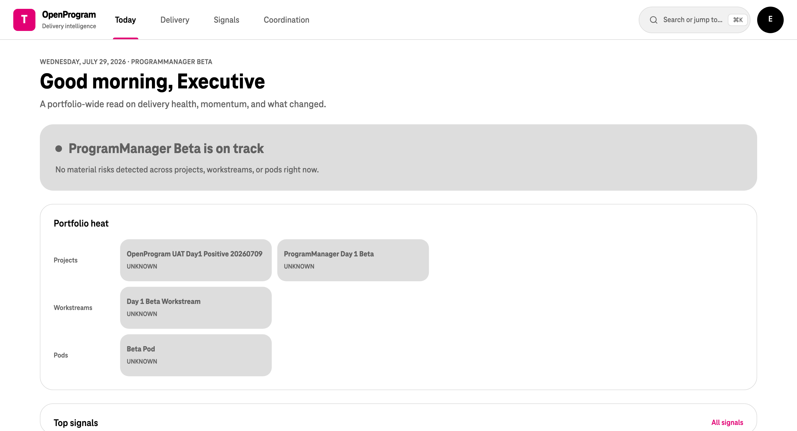
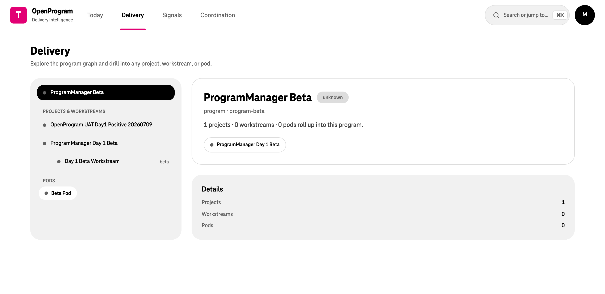
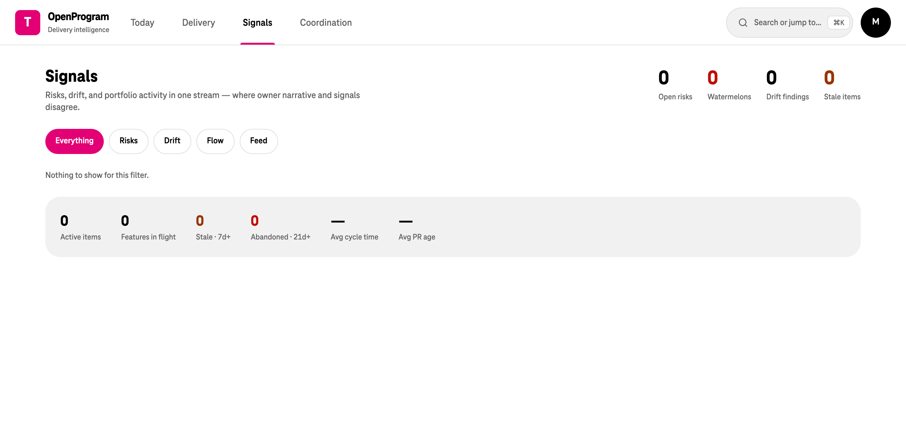
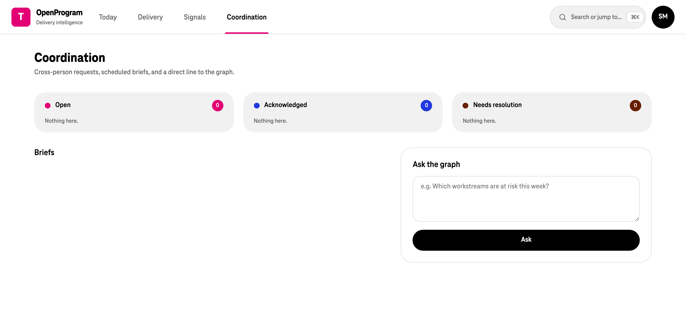
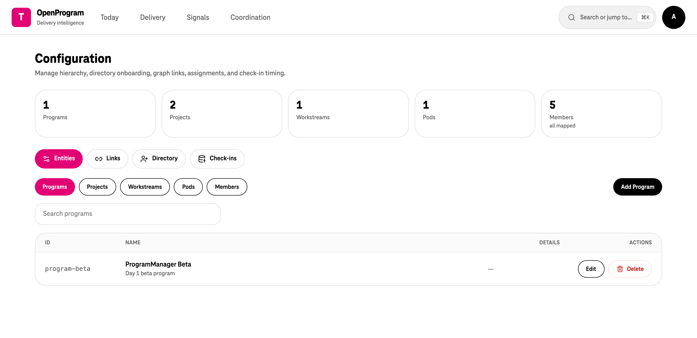
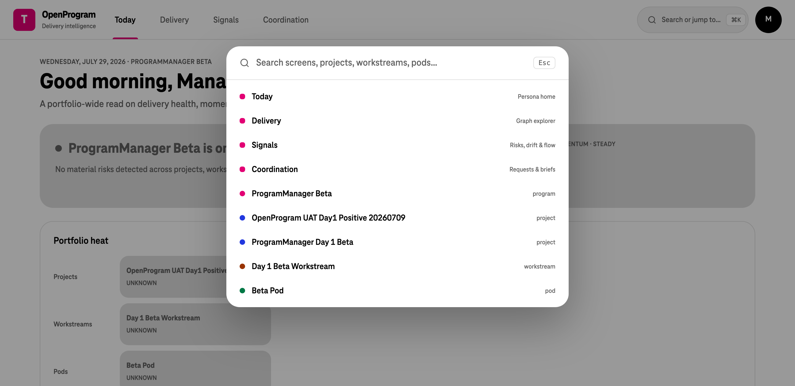

# OpenProgram

An agentic program-management system that keeps delivery status **continuously collected, reconciled, and rolled up** instead of assembled by hand in status meetings.

Instead of asking humans to report upward, OpenProgram asks developers a short conversational check-in in chat, cross-checks the answers against hard signals (Jira, Git, calendar), and derives every higher-level RAG indicator from those facts — so any red program dot can be drilled back down to the exact blocker on one person's task.

Three principles run through the whole system:

1. **One canonical graph, many views.** `program → project → workstream → pod → developer → task` is the single source of truth; each persona reads it through a different lens.
2. **Pull from humans, reconcile with systems.** Self-reported status is never trusted blindly — it is scored against delivery signals, and drift ("said done, no PR") is surfaced explicitly.
3. **Silence is never green.** A non-response becomes `unknown` with a lowered confidence score, not an assumed pass.

- Product concept and roadmap → [OpenProgramConcept.md](OpenProgramConcept.md)
- Business requirements / implemented feature set → [features.md](features.md)
- Engineering architecture and standards → [Architecture.md](Architecture.md)
- Low-level designs → [docs/lld/](docs/lld/)
- Ops runbooks (Slack setup, UAT) → [docs/ops/](docs/ops/)
- Hardening plans and current status → [plans/IMPLEMENTATION-STATUS.md](plans/IMPLEMENTATION-STATUS.md)

---

## Screens

The console lives in [`frontend-v2/`](frontend-v2) — four top-level destinations plus admin and a chat simulator, all wired to the real backend. Screenshots below are from a local stack with a near-empty demo tenant, so most indicators read `unknown`; that is the honest "no data yet" state, not a rendering bug.

### Today — persona home

Every role lands here. Developers get their check-in to confirm or correct plus a ranked focus list; managers and executives get a portfolio-wide read on health, momentum, and what changed.



### Delivery — graph explorer

Walk the program graph and drill into any project, workstream, or pod. Selection is URL-synced (`/delivery/:kind/:id`) so any view is linkable.



### Signals — risks, drift, and flow

Merges portfolio risks, flow metrics, and the activity feed into one ranked stream: stale tasks, repeated blockers, watermelon status (green over red), and reported-vs-actual drift.



### Coordination — requests, briefs, and ask-the-graph

Cross-person requests board, scheduled narrative briefs, and a natural-language query box that answers from the graph rather than from a free-form LLM guess.



### Admin — runtime configuration

Full CRUD over the hierarchy, directory onboarding, graph links, assignments, identity links, escalation contacts, write-back consent, and per-developer check-in timing.



### Command palette

`⌘K` anywhere jumps to a screen or any entity in the graph.



> There are **two** frontends in this repo. [`frontend/`](frontend) is the original console (dev server on **5173**) and remains the reference implementation CI builds: per-persona dashboard routes (`/me`, `/sm`, `/po`, `/mgr`, `/exec`) plus separate pages for pods, projects, workstreams, flow, portfolio, risks, cross-person requests, admin, and the mock-Slack simulator. [`frontend-v2/`](frontend-v2) is the IA redesign shown above (dev server on **5174**), collapsing all of that into `/today`, `/delivery`, `/signals`, `/coordination`, plus `/admin` and `/sim` behind the avatar menu.

---

## Architecture

Clean/hexagonal, enforced by `import-linter` in CI: the domain is pure, dependencies point inward, and every external system sits behind a port.

```
backend/
  core/
    domain/          # entities, value objects, rules — NO external imports
    application/     # use cases, agents (LangGraph nodes), orchestration
    ports/           # Protocol/ABC interfaces (chat, tracker, vcs, llm, repos)
  infra/
    adapters/        # chat/, directory/, jira/, github/, gitlab/, calendar/,
                     # llm/, auth/, secrets/, workflows/ (dbos.py + temporal.py)
    persistence/     # Postgres (+ Timescale) repositories, Alembic migrations
    workflows/       # provider-neutral workflow payloads and operations
    registry.py      # config -> adapter wiring (composition root)
  api/               # FastAPI routers, DTOs, dependency wiring
  config/            # pydantic-settings
  tests/             # unit/, contract/, integration/, bdd/
frontend/            # original React/Vite console (port 5173)
frontend-v2/         # redesigned console (port 5174)
```

**Dependency rule:** `api → application → domain`, and `infra → ports`. The core never imports a vendor SDK, `infra`, `api`, or `config.settings`; provider values thread through constructors. A guard test also bans the literal string `slack` inside `core`/`api` to keep the core provider-neutral (`chat_external_id`, not `slack_user_id`).

One port per capability, many swappable adapters:

| Port | Capability | Adapters |
|---|---|---|
| `ChatProvider` | DM / threaded conversation | Slack, mock-Slack simulator, fake |
| `DirectoryProvider` | user directory sync | Slack, fake |
| `IssueTracker` | issues, transitions, comments | Jira |
| `VcsProvider` | repos, commits, PRs | GitHub, GitLab |
| `CalendarProvider` | availability, PTO, timezone | Google |
| `LlmProvider` | model calls | LiteLLM |
| `GraphRepository` / `RollupRepository` / … | persistence | Postgres, in-memory |

### Tech stack

| Layer | Choice |
|---|---|
| Backend | Python 3.12, FastAPI, Pydantic v2 |
| Agents | LangGraph |
| LLM gateway | LiteLLM (Langfuse tracing) |
| Workflow engine | DBOS by default, Temporal selectable via config |
| Storage | PostgreSQL (+ TimescaleDB), Redis |
| Frontend | React 19, TypeScript, Vite, Tailwind |
| Observability | OpenTelemetry, Prometheus, Grafana |
| Tooling | uv, ruff, mypy, import-linter, pytest (+ pytest-bdd), Playwright |

Any workflow change must be mirrored in **both** engines — `infra/adapters/workflows/dbos.py` and `temporal.py` — with JSON-native payloads (ISO strings, no `datetime` objects).

---

## Quick start

Requirements: Docker, [uv](https://docs.astral.sh/uv/), Node 20+.

```bash
cp .env.example .env
```

Bring up the default stack — Postgres, Redis, LiteLLM, a mock LLM, the API, and the workflow worker (Langfuse, Temporal, and the observability stack are opt-in compose profiles):

```bash
docker compose up -d
```

Apply migrations:

```bash
make migrate
```

The API is then on <http://127.0.0.1:8000> (`/health`, `/ready`, `/metrics`, `/docs`). Start a console against it:

```bash
cd frontend-v2 && npm install && npm run dev
```

Open <http://127.0.0.1:5174>. In `local` environment with `auth_provider=dev` you are an unauthenticated admin and can switch persona from the avatar menu.

A fresh database has no hierarchy, so every indicator reads `unknown` until you populate the graph — either from the **Admin → Directory** screen (sync users from the chat directory, then import them as members) or through the `/config/*` API, then link projects → programs and pods → projects. The fastest end-to-end proof that needs no infra at all is `make phase1-smoke`, which builds a graph, runs a check-in, a nudge, a sync, and a rollup entirely in memory with fake providers.

If the backend is published on a different host port (via `OPENPROGRAM_BACKEND_PORT_BINDING`), point the dev server at it:

```bash
VITE_API_BASE_URL=http://127.0.0.1:8001 npm run dev
```

To run the API on the host instead of in a container, use `make api` (uvicorn with reload) plus `make worker`.

### Driving the check-in loop without Slack

Point chat and directory at the simulator and restart the backend:

```bash
OPENPROGRAM_CHAT_PROVIDER=mock_slack
OPENPROGRAM_DIRECTORY_PROVIDER=mock_slack
OPENPROGRAM_CHAT_SIMULATOR_ENABLED=true
```

Then use the `/sim` screen (or the `/test/chat-simulator/*` endpoints) to dispatch a check-in DM, reply as the developer, and watch the parsed status land in the rollup — replies travel the same webhook correlation path as real chat. Details in [mock-slack.md](mock-slack.md); for real Slack, follow [docs/ops/slack-setup.md](docs/ops/slack-setup.md).

---

## Configuration

All settings are `OPENPROGRAM_`-prefixed pydantic-settings, documented in [.env.example](.env.example). The ones that change behaviour most:

| Variable | Purpose |
|---|---|
| `OPENPROGRAM_ENVIRONMENT` | `local` enables dev conveniences; anything else hard-fails on dev auth or a default secret key |
| `OPENPROGRAM_RUNTIME_MODE` | `container` (Postgres/Redis) or `memory` (in-process fakes) |
| `OPENPROGRAM_AUTH_PROVIDER` | `dev` (unauthenticated admin, local only) or `oidc_bff` (cookie-based OIDC BFF) |
| `OPENPROGRAM_WORKFLOW_PROVIDER` | `dbos` or `temporal` |
| `OPENPROGRAM_CHAT_PROVIDER` | `slack`, `mock_slack`, or `fake` |
| `OPENPROGRAM_ISSUE_TRACKER_PROVIDER` / `VCS_PROVIDER` / `CALENDAR_PROVIDER` | `jira` / `github`\|`gitlab` / `google` |
| `OPENPROGRAM_CHECKIN_FANOUT_CRON` | when daily check-ins go out (per-developer local time is respected) |
| `OPENPROGRAM_CONVERSATION_RETENTION_DAYS` | retention for raw chat conversation history |

Jira write-back is **default-deny behind three independent gates**: a tenant flag (`jira_writeback_enabled`), the `WRITE_ISSUE_TRACKER` capability, and per-developer consent (`always_ask` / `auto_apply` / `never`). Only `writeback_service.py` may call the write path, and every applied change is audited and revertible.

---

## Development

```bash
make lint          # ruff check + format check + mypy + import-linter
make test          # pytest (unit + contract + bdd)
make integration   # container-backed integration tests (needs the stack up)
make phase1-smoke  # phase-1 flow end to end, in memory with fake providers
make smoke         # phase-0 smoke: readiness + a real LLM trace landing in Langfuse
make verify        # everything above, plus frontend lint/build and OpenAPI drift
```

`make smoke` asserts a Langfuse trace, so it needs that profile running: `docker compose --profile langfuse up -d`.

Frontend:

```bash
make frontend-install frontend-lint frontend-build   # original app
cd frontend-v2 && npm run lint && npm run typecheck && npm run build
```

**OpenAPI contract:** whenever an API route or DTO changes, regenerate the client — CI has a drift gate (`make openapi-check`).

```bash
make openapi && cd frontend && ./node_modules/.bin/prettier --write src/api/openapi.json && npm run generate:client
```

Use the **local** prettier binary, not a global `npx prettier` — version differences produce spurious diffs.

### Tests

| Suite | What it covers |
|---|---|
| `backend/tests/unit` | services, agents, parsing, settings, architecture boundaries |
| `backend/tests/contract` | each adapter against its port contract (Slack, Jira, GitHub, GitLab, Google Calendar) |
| `backend/tests/integration` | container-backed flows (`OPENPROGRAM_RUN_INTEGRATION=1`) |
| `backend/tests/bdd` | Gherkin scenarios for check-in, reply parsing, reliability, access control; some need the running simulator/LLM |
| `make ui-bdd` | Playwright-backed Mock Slack UI scenarios (`OPENPROGRAM_RUN_UI_BDD=1`) |

CI (`.github/workflows/ci.yml`) runs backend lint+types+tests, integration, and the frontend build on every PR.

---

## Repository map

| Path | Contents |
|---|---|
| [backend/](backend) | FastAPI service, agents, adapters, migrations, tests |
| [frontend/](frontend) | original React console (port 5173) |
| [frontend-v2/](frontend-v2) | redesigned console (port 5174) |
| [infra/](infra) | container, Prometheus, Grafana, OTel, and LiteLLM configuration |
| [scripts/](scripts) | mock LLM and local helper scripts |
| [docs/lld/](docs/lld) | low-level designs per seam |
| [docs/ops/](docs/ops) | Slack setup, UAT runbook, procurement |
| [plans/](plans) | reliability / correctness / features / helpfulness workstreams |
| [docker-compose.yml](docker-compose.yml) | full local stack with opt-in profiles |
| [Makefile](Makefile) | every task above |
