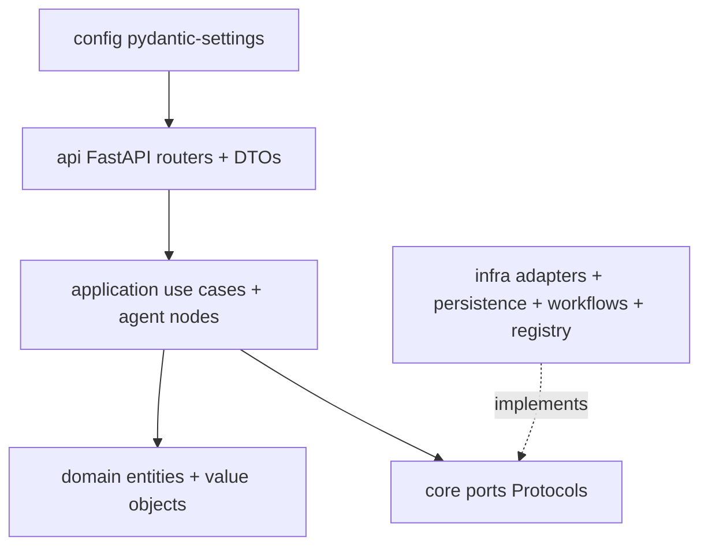

# Phase 0 LLD Overview

## Scope

Phase 0 establishes the runnable PulseOps foundation: a hexagonal FastAPI backend, Graph of Truth persistence seam, integration ports and first chat adapter, Temporal and LangGraph skeletons, React shell, observability, and CI/CD.

## Tech Versions

| Layer | Version / choice |
|---|---|
| Python | 3.12 |
| API | FastAPI + Pydantic v2 |
| Agents | LangGraph-compatible application node |
| LLM gateway | LiteLLM-compatible HTTP provider |
| Workflow | Temporal Python SDK |
| System of record | PostgreSQL 16 |
| Graph | Apache AGE extension schema seam |
| Time-series | TimescaleDB hypertable seam |
| Vector | pgvector seam |
| Cache | Redis |
| Frontend | React + TypeScript + Vite |
| UI | Tailwind CSS + shadcn-style components |
| Observability | structlog, OpenTelemetry collector, Prometheus, Grafana |

## Module Map

## Dependency Rule

- `core.domain` imports only Python standard library modules.
- `core.application` may import `core.domain` and `core.ports`.
- `core.ports` may import domain value objects and `typing.Protocol`.
- `api` depends on application services, ports, and edge DTOs.
- `infra` implements ports and contains vendor/database/workflow details.
- Vendor names are forbidden in `core`.

The rule is enforced through `.importlinter` and CI.

## Flow Documents

- [Graph of Truth](graph-of-truth.md)
- [Integration Seam](integration-seam.md)
- [Chat Roundtrip](chat-roundtrip.md)
- [Scheduled Workflow](scheduled-workflow.md)
- [Agent Skeleton](agent-skeleton.md)
- [Auth Seam](auth-seam.md)
- [Service and API](service-and-api.md)
- [Frontend Shell](frontend-shell.md)
- [Observability](observability.md)
- [Platform and CI/CD](platform-and-cicd.md)
