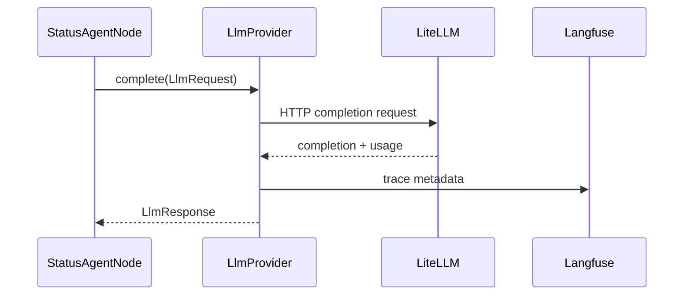

# Agent Skeleton LLD

## Classes

- `StatusAgentNode` in `core.application.agents.status_agent`.
- `LlmProvider` Protocol in `core.ports.llm`.
- `LiteLlmProvider` in `infra.adapters.llm`.

## Flow

## Trace Requirements

Every call records prompt hash, token counts, cost, latency, tenant, and correlation ID. Prompts are not written to normal logs.

## Tests

Unit tests use a fake `LlmProvider`. Integration tests can point `LiteLlmProvider` at a local LiteLLM gateway and Langfuse.
