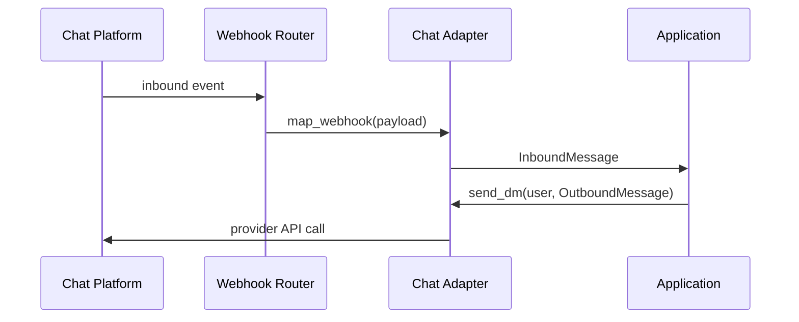

# Chat Roundtrip LLD

## Flow

## Classes

- `SlackChatAdapter`: first real adapter, isolated under `infra.adapters.chat`.
- `ChatWebhookMapper`: inbound provider payload mapper port.
- `SlackChatWebhookMapper`: Slack-specific inbound mapper.
- `HttpSlackClient`: Slack Web API implementation with bounded retry handling.
- `RedisRateLimiter`: runtime rate-limit seam backed by the Redis container.
- `InMemoryRateLimiter`: deterministic rate-limit seam for unit and contract tests.

## Mapping

Inbound webhooks map to `InboundMessage`. Outbound text maps from `OutboundMessage`. Raw inbound and outbound conversation turns are retained in the durable conversation store according to configured retention.

## Tests

- Shared `ChatProvider` and `ChatWebhookMapper` contracts run against fakes and real adapters.
- Adapter tests use a fake HTTP client plus recorded-style `respx` Slack Web API fixtures for open DM, send, reply, retry, and provider failures.

## Local Manual E2E

Use the local chat simulator when a tester needs a Slack-shaped roundtrip without real Slack credentials.

1. Set `OPENPROGRAM_CHAT_PROVIDER=mock_slack`, `OPENPROGRAM_DIRECTORY_PROVIDER=mock_slack`, and `OPENPROGRAM_CHAT_SIMULATOR_ENABLED=true` in `.env`.
2. Start the stack and frontend, then sync the directory from Admin Config.
3. Add one or more synced users as members.
4. Open `/mock-slack`, dispatch a check-in, inspect the outbound bot DM, and submit a reply.
5. Verify the developer dashboard or pod check-in view shows the confirmed status.

The simulator state is in memory during `runtime_mode=memory` and Redis-backed in container mode so backend, worker, and scheduler processes share the same local mailbox.
