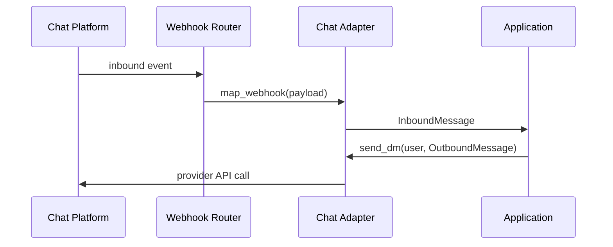

# Chat Roundtrip LLD

## Flow

## Classes

- `SlackChatAdapter`: first real adapter, isolated under `infra.adapters.chat`.
- `SlackHttpClient`: small Protocol over HTTP calls for recorded tests.
- `InMemoryRateLimiter`: deterministic retry/rate-limit seam for local and contract tests.

## Mapping

Inbound webhooks map to `InboundMessage`. Outbound text maps from `OutboundMessage`. Raw DM content is never logged; structured logs redact message fields.

## Tests

- Shared `ChatProvider` contract runs against the fake and adapter.
- Adapter tests use a fake HTTP client, and the same seam can be backed by recorded HTTP with `respx`.
