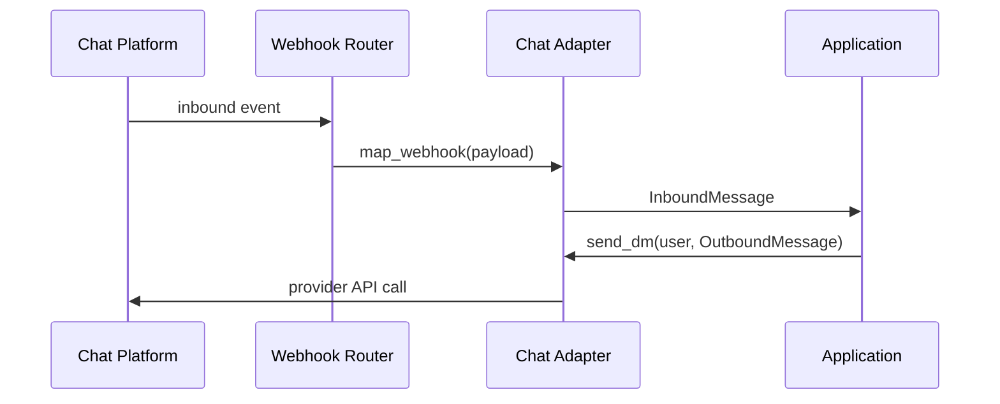

# Chat Roundtrip LLD

## Flow

## Classes

- `SlackChatAdapter`: first real adapter, isolated under `infra.adapters.chat`.
- `HttpSlackClient`: Slack Web API implementation with bounded retry handling.
- `RedisRateLimiter`: runtime rate-limit seam backed by the Redis container.
- `InMemoryRateLimiter`: deterministic rate-limit seam for unit and contract tests.

## Mapping

Inbound webhooks map to `InboundMessage`. Outbound text maps from `OutboundMessage`. Raw DM content is never logged; structured logs redact message fields.

## Tests

- Shared `ChatProvider` contract runs against the fake and adapter.
- Adapter tests use a fake HTTP client plus recorded-style `respx` Slack Web API fixtures for open DM, send, reply, retry, and provider failures.
