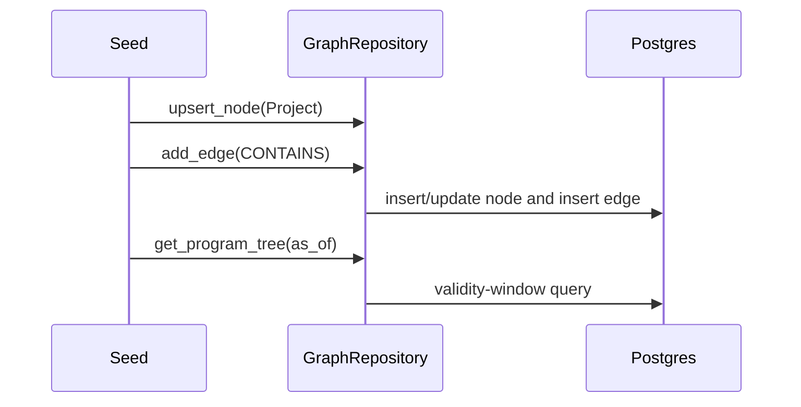

# Graph of Truth LLD

## Domain Classes

- `Program`, `Project`, `Pod`, `Developer`, and `Task` are frozen dataclasses in `core.domain.graph`.
- `GraphEdge` carries a typed `EdgeKind` (`CONTAINS`, `ASSIGNED_TO`, `DEPENDS_ON`) plus optional `valid_from` and `valid_to`.
- `FactEvent` is append-only and carries `tenant_id`, `source`, `entity_ref`, `payload`, `observed_at`, `ingested_at`, and `correlation_id`.

## Ports

```python
class GraphRepository(Protocol):
    async def upsert_node(self, node: GraphNode) -> None: ...
    async def add_edge(self, edge: GraphEdge) -> None: ...
    async def get_program_tree(self, tenant_id: str, program_id: str, as_of: date) -> GraphTree: ...
    async def active_developer_memberships(self, tenant_id: str, developer_id: str, as_of: date) -> list[GraphEdge]: ...

class TimeSeriesRepository(Protocol):
    async def append_fact(self, fact: FactEvent) -> None: ...
    async def list_facts(self, tenant_id: str, entity_ref: EntityRef) -> list[FactEvent]: ...

class VectorStore(Protocol):
    async def upsert_embedding(self, tenant_id: str, entity_ref: EntityRef, vector: Sequence[float]) -> None: ...
    async def search(self, tenant_id: str, vector: Sequence[float], limit: int) -> list[VectorMatch]: ...
```

## Persistence Schema

- `graph_nodes`: tenant-scoped node records with immutable external IDs.
- `graph_edges`: typed edges with optional validity windows.
- `facts`: append-only Timescale-ready event log.
- `vector_items`: pgvector-ready embedding records.

The migration enables `age`, `timescaledb`, and `vector` extensions when available and creates ordinary tables so local development still works when an extension image is incomplete.

## Sequence



## Tests

- Unit tests run against `InMemoryGraphRepository`.
- Integration tests target Postgres through Testcontainers once Docker is available.
- The domain package is protected by import-linter.
