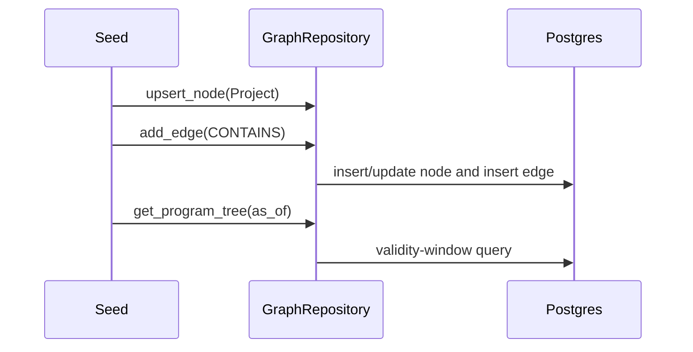

# Graph of Truth LLD

## Domain Classes

- `Program`, `Project`, `Pod`, `Developer`, and `Task` are frozen dataclasses in `core.domain.graph`.
- `GraphEdge` carries a typed `EdgeKind` (`CONTAINS`, `ASSIGNED_TO`, `DEPENDS_ON`) plus optional `valid_from` and `valid_to`.
- `FactEvent` is append-only and carries `tenant_id`, `source`, `entity_ref`, `payload`, `observed_at`, `ingested_at`, and `correlation_id`.

## Ports

```python
class GraphRepository(Protocol):
    async def upsert_node(self, node: GraphNode) -> None: ...
    async def delete_node(self, tenant_id: str, id: str, *, on: date) -> None: ...
    async def add_edge(self, edge: GraphEdge) -> None: ...
    async def end_edge(self, edge: GraphEdge, on: date) -> None: ...
    async def get_program_tree(self, tenant_id: str, program_id: str, as_of: date) -> GraphTree: ...
    async def active_developer_memberships(
        self, tenant_id: str, developer_id: str, as_of: date
    ) -> list[GraphEdge]: ...


class TimeSeriesRepository(Protocol):
    async def append_fact(self, fact: FactEvent) -> None: ...
    async def list_facts(self, tenant_id: str, entity_ref: EntityRef) -> list[FactEvent]: ...


class VectorStore(Protocol):
    async def upsert_embedding(
        self, tenant_id: str, entity_ref: EntityRef, vector: Sequence[float]
    ) -> None: ...
    async def search(
        self, tenant_id: str, vector: Sequence[float], limit: int
    ) -> list[VectorMatch]: ...
```

## Persistence Schema

- AGE graph `openprogram_graph`: typed node and edge mirror used by the Postgres adapter on writes.
- `graph_nodes`: tenant-scoped node records with immutable external IDs for API queries.
- `graph_edges`: typed edges with optional validity windows for API queries.
- `facts`: append-only Timescale-ready event log.
- `vector_items`: pgvector embedding records and cosine-similarity search.

The migration strictly requires `age`, `timescaledb`, and `vector`; it fails if the custom Postgres container image does not provide them.

## History

A read for a day sees the graph as it stood that day, so a change never rewrites an earlier day.

- An edge holds over `[valid_from, valid_to)`. A link made through the config API starts the day it is made.
- Unlinking ends an edge that day (`end_edge`): earlier days still read it. One that would then hold on no day (it starts that day or later) is erased; `remove_edge` erases one outright.
- `delete_node(on=...)` ends the node's edges that day and keeps the node, with the day under the reserved metadata key `deleted_on`, so runtime config needs no new schema. Node reads without `as_of` leave it out; reads with an earlier `as_of` still find it. `upsert_node` restores it, with its old edges still ended.
- The AGE mirror keeps every relational edge row. Ending or erasing one rewrites the mirror edges of that node pair from the relational rows, as migration `0027` rebuilds the whole mirror.

## Sequence


```mermaid
sequenceDiagram
    participant Seed
    participant Repo as GraphRepository
    participant DB as Postgres
    Seed->>Repo: upsert_node(Project)
    Seed->>Repo: add_edge(CONTAINS)
    Repo->>DB: insert/update node and insert edge
    Seed->>Repo: get_program_tree(as_of)
    Repo->>DB: validity-window query
```

## Tests

- Unit tests run against `InMemoryGraphRepository`.
- Integration tests target the custom compose-backed Postgres service through Testcontainers when Docker is available.
- The domain package is protected by import-linter.
