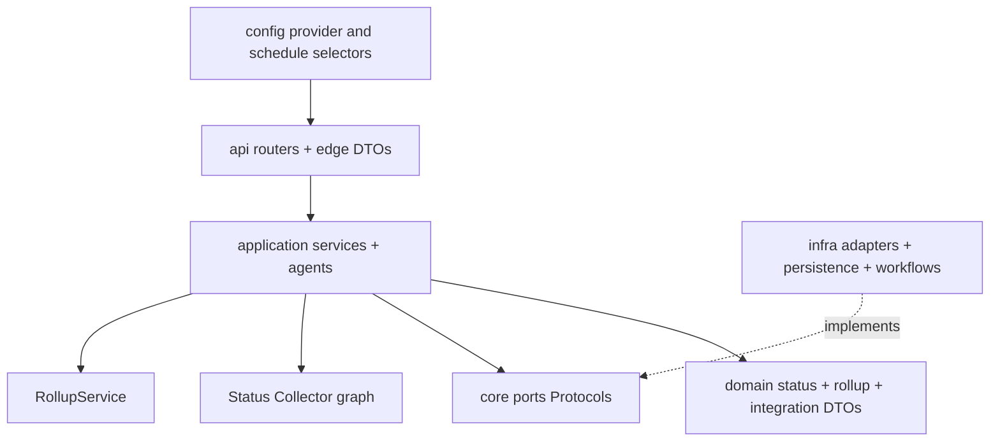
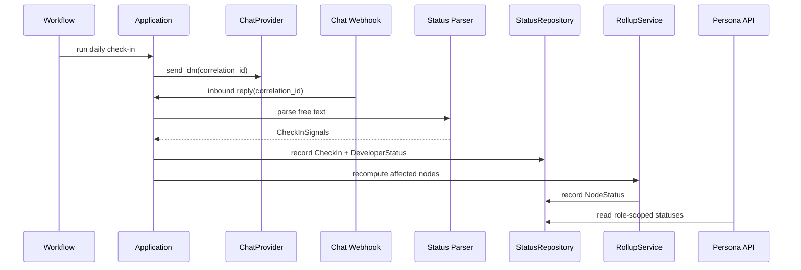

# Phase 1 LLD Overview

## Scope

Phase 1 Sense proves the first user-facing agentic loop on top of Phase 0:

1. Schedule a developer check-in.
2. Send a proactive DM with context from read integrations.
3. Accept a free-text reply.
4. Parse the reply into structured signals.
5. Persist the check-in and developer status.
6. Roll status up through pod, project, and program nodes.
7. Serve role-scoped persona views.

Phase 1 does not perform issue tracker, VCS, or calendar writes. It does not reconcile human status against hard signals beyond coarse `StatusSource` tags, and it does not predict delivery risk.

## Module Map

## Dependency Rule

- `api` depends on application services, ports, and API DTOs.
- `core.application` depends on `core.domain` and `core.ports`.
- `core.domain` imports only Python standard library modules.
- `core.ports` contains vendor-neutral `Protocol` interfaces and domain DTO imports.
- `infra` implements ports and owns SQL, workflow runtime code, SDK clients, provider payloads, and provider-specific names.
- Vendor names are forbidden in `core` symbols and modules. Provider IDs may appear in configuration, infrastructure, tests, and docs.

This preserves the Phase 0 rule: `api -> application -> domain`, and `infra -> ports`.

## New Domain Models

| Module | Model | Purpose |
|---|---|---|
| `core.domain.integrations` | `SyncCursor` | Provider-neutral cursor for incremental read syncs. |
| `core.domain.integrations` | `Project`, `Sprint`, `Issue`, `Repo`, `Commit`, `PullRequest`, `CalendarEvent`, `UserRef` | Anti-corruption DTOs for read integrations. |
| `core.domain.status` | `StatusSource` | Coarse source tag: `CONFIRMED`, `INFERRED`, `STALE`, `UNKNOWN`. |
| `core.domain.status` | `Mood` | Optional parsed reply mood: `POSITIVE`, `NEUTRAL`, `NEGATIVE`. |
| `core.domain.status` | `CheckInSignals` | Parsed free-text fields: progress note, blockers, ETA change, mood. |
| `core.domain.status` | `CheckIn` | One asked/replied check-in with correlation and optional raw reply. |
| `core.domain.status` | `DeveloperStatus` | As-of developer summary used by rollups and views. |
| `core.domain.rollup` | `Rag` | Rollup health: `GREEN`, `AMBER`, `RED`, `UNKNOWN`. |
| `core.domain.rollup` | `RollupFactor` | Explainability factor with a drill target. |
| `core.domain.rollup` | `NodeStatus` | As-of status for pod, project, program, or another graph node. |

## Port Deltas

- `IssueTracker` read methods: `list_projects`, `list_issues_updated_since`, `list_sprints`, `get_issue`, and `list_active_for`.
- Existing `IssueTracker.transition` and `IssueTracker.add_comment` remain outside Phase 1 use cases.
- `VcsProvider` read methods: `list_repos`, `list_commits`, `list_pull_requests`, and `list_pull_requests_for`.
- `CalendarProvider.list_events` supports availability, PTO, and timezone reads through application services.
- `StatusRepository` records check-ins and latest developer statuses.
- `RollupRepository` records and lists node rollups.
- `SyncCursorRepository` stores provider-neutral incremental cursors.
- Existing `GraphRepository` and `TimeSeriesRepository` receive graph mutations and append-only facts from sync services.
- Existing `ChatProvider` and `LlmProvider` are reused by the Status Collector.

## Persistence Schema Deltas

- `connector_sync_cursors`: tenant-scoped cursor state keyed by connector and scope.
- `checkin_preferences`: per-developer local check-in time, timezone, and weekday preferences.
- `checkin_correlations`: maps outbound chat thread/message references to a provider-neutral check-in correlation ID.
- `checkins`: asked/replied check-ins, raw reply text, parsed signals JSON, and timestamps. Raw inbound and outbound turns are also retained in the durable conversation store according to configured retention.
- `developer_statuses`: append-only or as-of rows for `DeveloperStatus`, keyed by tenant, developer, and date.
- `node_statuses`: persisted `NodeStatus` rollups with RAG, source tag, factors JSON, and as-of date.
- Existing `graph_nodes`, `graph_edges`, and `facts` remain the system of record for graph structure and append-only evidence.

All external read-sync facts use `TimeSeriesRepository.append_fact`. Internal writes are allowed only to PulseOps persistence. The only Phase 1 external side effect is a chat DM or nudge through `ChatProvider`; there is no write-back to issue tracker, VCS, or calendar systems.

## End-to-End Sequence

## Flow Documents

- [Read Integrations](read-integrations.md)
- [Status Collector](status-collector.md)
- [Status Parsing](status-parsing.md)
- [Rollup Engine](rollup-engine.md)
- [Persona Views](persona-views.md)
- [Scheduling and Nudges](scheduling-and-nudges.md)

## Test Approach

- Pure unit tests cover status parsing validation, availability decisions, scheduling idempotency, and rollup rules.
- Port contract tests run against fakes and real read adapters with recorded HTTP.
- Integration tests cover Postgres schema deltas, graph/fact writes, and workflow replay/idempotency.
- API tests verify default-deny authorization and stable persona contracts; conversation-turn exposure requires an explicit route/DTO change.
- Frontend checks use the existing lint, typecheck, build, and generated API client workflow.
