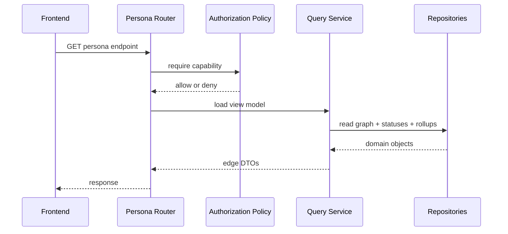

# Persona Views LLD

## Scope

Persona views are read-only API and frontend slices over the same graph, status, rollup, and conversation-store data. They are scoped by the Phase 0 default-deny authorization policy.

Raw inbound and outbound DM turns are persisted in the durable conversation store with configurable retention. This document does not add a persona API for raw conversation turns; Phase 1 views show source tags (`CONFIRMED`, `INFERRED`, `STALE`, `UNKNOWN`), not confidence scores.

## API Endpoints

| Persona | Endpoint | Capability | Purpose |
|---|---|---|---|
| Dev | `GET /me/focus` | `view_own_focus` | My tasks, blockers, deadlines, and source-tagged status. |
| SM | `GET /pods/{pod_id}/blockers` | `view_pod_blockers` | Blocker board with owner, age, and source refs. |
| SM | `GET /pods/{pod_id}/checkins` | `view_pod_checkins` | Check-in completeness and stale developers. |
| PO | `GET /projects/{project_id}/progress` | `view_project_progress` | Feature/epic progress from synced issue data and rollups. |
| Mgr/Exec | `GET /programs/{program_id}/tree` | `view_program_tree` | Hierarchy tree with RAG and drill refs. |
| Mgr/Exec | `GET /portfolio/heatmap` | `view_portfolio_heatmap` | Program/project RAG grid with one-line why. |

Each router resolves the current `Principal`, asks the authorization policy for the capability, and delegates to an application query service.

## DTO Rules

- API DTOs live in `api.dtos`.
- Domain dataclasses are not returned directly.
- DTOs include `rag`, `source`, `summary`, `factors`, and provider-neutral `source_ref`.
- DTOs remain provider-neutral and do not add new conversation-turn fields in this slice.
- Exec views aggregate by default and do not expose developer-level raw check-in text.

## Application Services

- `DevFocusQuery`: reads active tasks, latest developer status, and relevant rollup factors for the current principal.
- `PodStatusQuery`: reads pod rollup, blockers, check-in completeness, and stale statuses.
- `ProjectProgressQuery`: reads project rollup and issue-derived progress facts.
- `PortfolioQuery`: reads program tree and `RollupRepository.list_node_statuses`.

All services read through repository ports and authorization policy decisions.

## API Sequence

## Frontend Shape

- `frontend/src/features/dev-focus`: focus list and source-tagged status.
- `frontend/src/features/pod-status`: blocker board and check-in completeness.
- `frontend/src/features/project-progress`: epic/feature progress.
- `frontend/src/features/portfolio`: hierarchy tree and heatmap.
- Shared status components render RAG, source tag, one-line why, and drill action.
- TanStack Query owns server state.
- ECharts renders the heatmap through a wrapper component.
- React Flow renders the hierarchy tree through a wrapper component.
- The typed client is regenerated from FastAPI OpenAPI.

## Read Boundary

Persona endpoints are read-only. They never trigger syncs, check-ins, nudges, external writes, or status recomputation with side effects. If a view needs fresh rollups, it requests a read model already persisted by the rollup workflow or calls a pure read-time computation path that writes nothing.

## Tests

- API tests cover allow and deny cases for every capability.
- DTO tests assert provider payloads are absent and that persona contracts remain stable unless a route explicitly adds conversation fields.
- Query service tests use fake repositories and principals.
- Frontend tests cover loading, empty, denied, stale, inferred, and drill states.
- OpenAPI generation and TypeScript build verify contract alignment.
