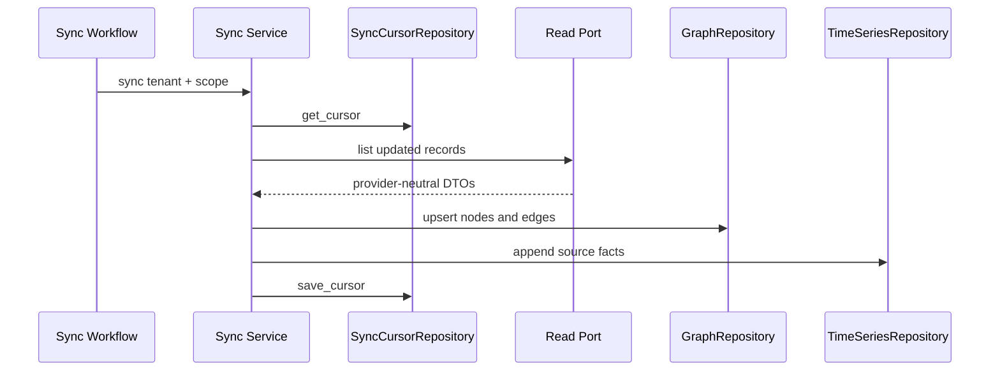

# Read Integrations LLD

## Scope

Read integrations populate PulseOps state from external systems without mutating those systems. Phase 1 syncs:

- Issue tracker projects, sprints, issues, assignees, and update timestamps.
- VCS repositories, commits, and pull requests.
- Calendar availability, PTO, and timezone signals.

Provider payloads are translated at adapter boundaries. Core models and ports stay provider-neutral.

## Ports

```python
class IssueTracker(Protocol):
    async def list_projects(self, tenant_id: str) -> list[Project]: ...
    async def list_issues_updated_since(
        self, tenant_id: str, project_key: str, cursor: SyncCursor
    ) -> list[Issue]: ...
    async def list_sprints(self, tenant_id: str, board_id: str) -> list[Sprint]: ...
    async def get_issue(self, tenant_id: str, key: str) -> Issue: ...
    async def list_active_for(self, assignee: UserRef) -> list[Issue]: ...

class VcsProvider(Protocol):
    async def list_repos(self, tenant_id: str) -> list[Repo]: ...
    async def list_commits(
        self, tenant_id: str, repo: str, cursor: SyncCursor
    ) -> list[Commit]: ...
    async def list_pull_requests(
        self, tenant_id: str, repo: str, cursor: SyncCursor | None = None
    ) -> list[PullRequest]: ...
    async def list_pull_requests_for(self, author: UserRef) -> list[PullRequest]: ...

class CalendarProvider(Protocol):
    async def list_events(self, user: UserRef, start: date, end: date) -> list[CalendarEvent]: ...

class SyncCursorRepository(Protocol):
    async def get_cursor(self, tenant_id: str, connector: str, scope: str) -> SyncCursor: ...
    async def save_cursor(
        self, tenant_id: str, connector: str, scope: str, cursor: SyncCursor
    ) -> None: ...
```

`IssueTracker.transition` and `IssueTracker.add_comment` may exist for later phases but are not called by Phase 1 application code.

## Application Services

- `IssueSyncService`: reads projects, sprints, and changed issues; upserts `Task` nodes; maintains `CONTAINS` and `ASSIGNED_TO` edges; appends issue facts.
- `VcsActivitySyncService`: reads repositories, commits, and pull requests; appends activity facts linked to developer and repository refs.
- `AvailabilityService`: reads calendar events and answers availability, PTO, and timezone questions for scheduling.
- `ConnectorSyncService`: wraps provider calls with cursor load/save, idempotency keys, correlation IDs, and structured logging.

All services depend on ports and domain DTOs only.

## Persistence Schema

- `connector_sync_cursors`
  - `tenant_id TEXT NOT NULL`
  - `connector TEXT NOT NULL`
  - `scope TEXT NOT NULL`
  - `cursor_value TEXT`
  - `metadata JSONB NOT NULL DEFAULT '{}'::jsonb`
  - `updated_at TIMESTAMPTZ NOT NULL`
  - Primary key: `(tenant_id, connector, scope)`
- Existing `graph_nodes`
  - Upsert `task` nodes for synced issues.
  - Preserve current `program`, `project`, `pod`, and `developer` nodes.
- Existing `graph_edges`
  - Insert/update `CONTAINS` edges from project to task.
  - Insert/update `ASSIGNED_TO` edges from task to developer.
  - Keep validity windows for historical queries.
- Existing `facts`
  - Append issue, commit, pull request, and calendar facts.
  - Fact IDs are never reused; retries dedupe at the service level before append.

## Sync Sequence



## Idempotency

- Issue sync idempotency key: `(tenant_id, issue_key, updated_at)`.
- Commit sync idempotency key: `(tenant_id, repo, sha)`.
- Pull request sync idempotency key: `(tenant_id, repo, pull_request_id, updated_at)`.
- Calendar fact idempotency key: `(tenant_id, user_external_id, starts_on, ends_on, kind)`.
- Cursor saves happen after successful graph and fact writes.

## Read-Only Boundary

- Issue tracker reads may inspect issues, projects, sprints, transitions, and active assignments.
- VCS reads may inspect repos, commits, and pull requests.
- Calendar reads may inspect events needed for availability.
- Phase 1 never transitions issues, comments on issues, writes commits, updates pull requests, creates calendar events, or modifies external availability.

## Tests

- Domain unit tests cover DTO normalization and cursor comparison.
- Application unit tests use fake read ports, in-memory graph/fact repositories, and cursor fakes.
- Shared contract tests run against every real adapter using recorded HTTP fixtures.
- Integration tests verify graph node/edge writes, append-only facts, cursor persistence, and no calls to write methods.
