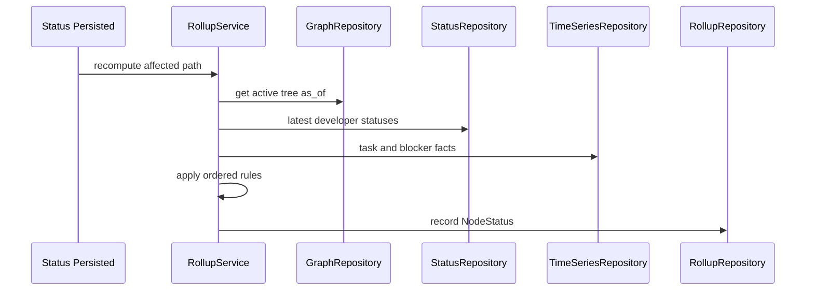

# Rollup Engine LLD

## Scope

The rollup engine derives explainable status from developer statuses and graph structure:

- Developer status comes from `DeveloperStatus`.
- Pod status derives from active developer memberships.
- Project status derives from pods and tasks.
- Program status derives from projects.

The engine uses deterministic weighted rules. It does not forecast, reconcile, or produce confidence scores.

## Domain Classes

- `Rag`: `GREEN`, `AMBER`, `RED`, `UNKNOWN`.
- `RollupFactor`: explanation text, contributing RAG, and `source_ref`.
- `NodeStatus`: graph entity ref, RAG, weakest contributing `StatusSource`, factors, and as-of date.

## Ports

```python
class RollupRepository(Protocol):
    async def record_node_status(self, status: NodeStatus) -> None: ...
    async def latest_node_status(
        self, tenant_id: str, entity_ref: EntityRef, as_of: date
    ) -> NodeStatus | None: ...
    async def list_node_statuses(self, tenant_id: str, as_of: date) -> list[NodeStatus]: ...
```

`RollupService` also reads:

- `GraphRepository.get_program_tree`
- `GraphRepository.active_developer_memberships`
- `StatusRepository.latest_developer_status`
- `TimeSeriesRepository.list_facts`

## Rules

Rules are ordered and deterministic:

1. If a node has no active children or no usable status, return `UNKNOWN`.
2. A critical-path blocker contributes `RED`.
3. Multiple active blockers under the same parent contribute `RED`.
4. A stale child status contributes at least `AMBER`.
5. An inferred child status contributes at least `AMBER`.
6. A single non-critical blocker contributes `AMBER`.
7. All current confirmed child statuses with no blockers contribute `GREEN`.

The final RAG is the maximum severity of all contributing factors. This is intentionally not an average.

`NodeStatus.source` uses the weakest contributing source in this order:

1. `UNKNOWN`
2. `STALE`
3. `INFERRED`
4. `CONFIRMED`

## Critical Path V1

Phase 1 critical path is deliberately simple:

- A task is critical when its graph metadata marks it critical.
- A task is critical when it has high dependency fan-in through `DEPENDS_ON`.
- A task is critical when the synced issue metadata marks it with a configured priority or label.

No schedule simulation or prediction is performed.

## Persistence Schema

- `node_statuses`
  - `tenant_id TEXT NOT NULL`
  - `entity_kind TEXT NOT NULL`
  - `entity_id TEXT NOT NULL`
  - `as_of DATE NOT NULL`
  - `rag TEXT NOT NULL`
  - `source TEXT NOT NULL`
  - `factors JSONB NOT NULL DEFAULT '[]'::jsonb`
  - `created_at TIMESTAMPTZ NOT NULL DEFAULT now()`
  - Primary key: `(tenant_id, entity_kind, entity_id, as_of)`

Each factor stores a provider-neutral source reference that can drill to a developer, task, or fact.

## Sequence



## Drill Path

Every non-green rollup must include at least one `RollupFactor`. The factor `source_ref` points to the lowest known source:

- Developer status for check-in blockers.
- Task node for issue-derived blockers.
- Fact event for activity-derived inferred status.

Persona views use these refs to navigate from program to project, pod, developer, task, or fact without adding conversation-turn fields to rollup DTOs.

## Tests

- Pure unit tests cover each ordered rule.
- Golden table tests cover dev to pod, pod to project, and project to program rollups.
- Edge tests cover no children, stale statuses, inferred statuses, critical-path blockers, and conflicting child states.
- Repository tests verify as-of querying and factor JSON persistence.
