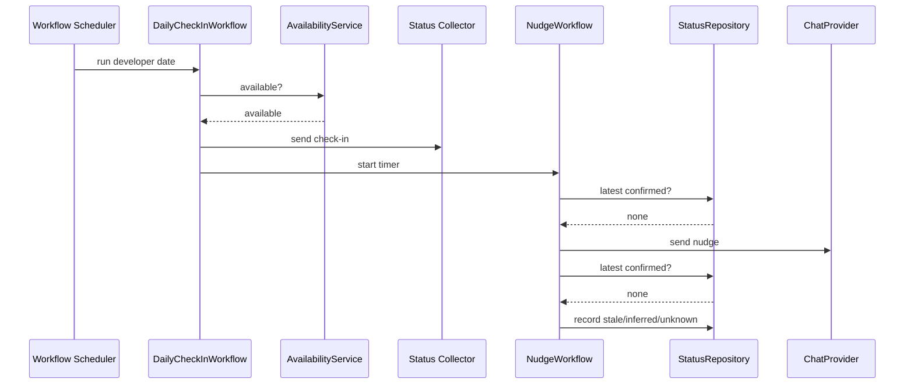

# Scheduling and Nudges LLD

## Scope

Scheduling and nudges provide durable orchestration for the Status Collector:

- Schedule one daily check-in per developer at the preferred local time.
- Respect calendar availability, PTO, and timezone.
- Send at most one nudge for a missed reply.
- Mark non-responders as `STALE`, `INFERRED`, or `UNKNOWN`.

Scheduling does not write to issue tracker, VCS, or calendar systems.

## Domain and Settings

- Preferred time comes from a per-developer check-in preference.
- Timezone comes from preference first, then calendar metadata, then a tenant default.
- Default check-in time is `09:30` local when no preference exists.
- Weekends and unavailable calendar days are skipped unless explicitly configured.
- Reply and nudge windows are tenant settings.

## Workflow Inputs

```python
@dataclass(frozen=True, kw_only=True)
class DailyCheckInInput:
    tenant_id: str
    developer_id: str
    checkin_date: date
    correlation_id: str

@dataclass(frozen=True, kw_only=True)
class NudgeInput:
    tenant_id: str
    developer_id: str
    checkin_date: date
    correlation_id: str
```

These are workflow DTOs at the infrastructure edge. Application code receives provider-neutral primitives and domain objects.

## Workflows

`DailyCheckInWorkflow`:

1. Load check-in preference.
2. Ask `AvailabilityService` whether the developer is available.
3. Skip without stale status when the developer is on PTO or outside configured check-in days.
4. Invoke the Status Collector activity.
5. Start or signal `NudgeWorkflow`.

`NudgeWorkflow`:

1. Wait for the configured reply window.
2. Query `StatusRepository` for a confirmed status.
3. If confirmed, exit.
4. Send exactly one nudge through `ChatProvider`.
5. Wait for the final reply window.
6. If still no reply, record:
   - `DeveloperStatus(source=INFERRED)` when recent facts can produce a safe summary.
   - `DeveloperStatus(source=STALE)` when prior status exists but no new reply exists.
   - `DeveloperStatus(source=UNKNOWN)` when neither reply nor usable facts exist.

Silence never becomes confirmed green.

## Persistence Schema

- `checkin_preferences`
  - `tenant_id TEXT NOT NULL`
  - `developer_id TEXT NOT NULL`
  - `preferred_local_time TIME`
  - `timezone TEXT`
  - `weekdays JSONB NOT NULL DEFAULT '[1,2,3,4,5]'::jsonb`
  - Primary key: `(tenant_id, developer_id)`
- `checkin_schedule_runs`
  - `tenant_id TEXT NOT NULL`
  - `developer_id TEXT NOT NULL`
  - `checkin_date DATE NOT NULL`
  - `correlation_id TEXT NOT NULL`
  - `status TEXT NOT NULL`
  - `started_at TIMESTAMPTZ NOT NULL`
  - `completed_at TIMESTAMPTZ`
  - Primary key: `(tenant_id, developer_id, checkin_date)`
- `checkin_nudges`
  - `tenant_id TEXT NOT NULL`
  - `developer_id TEXT NOT NULL`
  - `checkin_date DATE NOT NULL`
  - `correlation_id TEXT NOT NULL`
  - `sent_at TIMESTAMPTZ NOT NULL`
  - Primary key: `(tenant_id, developer_id, checkin_date)`

## Idempotency

- Daily check-in idempotency key: `(tenant_id, developer_id, checkin_date)`.
- Nudge idempotency key: `(tenant_id, developer_id, checkin_date)`.
- The nudge table primary key prevents duplicate nudges across retries.
- Replayed workflow activities check repository state before sending chat messages.
- Recording stale, inferred, or unknown statuses is idempotent for the same as-of date and source.

## Sequence



## Tests

- Unit tests cover timezone selection, PTO skip, weekend skip, and default time.
- Workflow tests cover replay safety and idempotent duplicate starts.
- Nudge tests verify exactly one outbound nudge.
- Non-response tests verify `STALE`, `INFERRED`, and `UNKNOWN` selection.
- Privacy tests assert no raw DM content appears in workflow logs.
