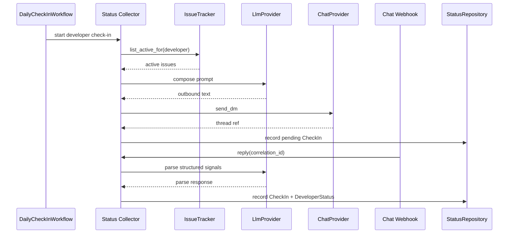

# Status Collector LLD

## Scope

The Status Collector is the Phase 1 agent loop:

1. Build context from active issues and recent facts.
2. Compose a concise proactive DM.
3. Send the DM through `ChatProvider`.
4. Correlate the developer's free-text reply through webhook intake.
5. Parse the reply into `CheckInSignals`.
6. Persist `CheckIn` and `DeveloperStatus(source=CONFIRMED)`.

The collector does not write to issue tracker, VCS, or calendar systems.

## Agent State

```python
class StatusCollectorState(TypedDict, total=False):
    tenant_id: str
    developer_id: str
    developer_name: str
    as_of: date
    correlation_id: str
    active_issues: list[Issue]
    recent_fact_refs: list[EntityRef]
    prompt_context: str
    outbound_text: str
    chat_thread_ref: str
    raw_reply: str
    signals: CheckInSignals
    status: DeveloperStatus
```

The existing single-node status agent becomes a multi-node collector graph while preserving the rule that LLM access goes through `LlmProvider`.

## Graph Nodes

- `build_context`: loads active issues via `IssueTracker.list_active_for`, recent facts via `TimeSeriesRepository`, and current graph membership via `GraphRepository`.
- `compose_dm`: calls `LlmProvider` to produce a short conversational prompt grounded in the context.
- `send_dm`: calls `ChatProvider.send_dm`, records `checkin_correlations`, and records a `CheckIn` with `replied_at=None`.
- `await_reply`: waits for a workflow signal or webhook-correlated inbound message. It does not poll provider APIs unless the chat port exposes a provider-neutral reply fetch.
- `parse`: delegates to the status parser described in [Status Parsing](status-parsing.md).
- `persist`: records the completed `CheckIn`, records `DeveloperStatus(source=CONFIRMED)`, and appends a check-in fact.

## Ports

- `ChatProvider`: outbound DM and optional thread/reply support.
- `IssueTracker`: active issue context only; no transition or comment calls.
- `LlmProvider`: prompt composition and structured parsing through provider-neutral requests.
- `StatusRepository`: `record_checkin`, `record_developer_status`, `latest_developer_status`, `developers_without_checkin`.
- `GraphRepository`: active developer membership and drill-path context.
- `TimeSeriesRepository`: recent activity facts and append-only check-in facts.
- `CheckInCorrelationRepository`: maps inbound chat metadata to `correlation_id`.

## Persistence Schema

- `checkin_correlations`
  - `tenant_id TEXT NOT NULL`
  - `correlation_id TEXT NOT NULL`
  - `developer_id TEXT NOT NULL`
  - `chat_user_ref TEXT NOT NULL`
  - `chat_thread_ref TEXT NOT NULL`
  - `asked_at TIMESTAMPTZ NOT NULL`
  - `consumed_at TIMESTAMPTZ`
  - Primary key: `(tenant_id, correlation_id)`
- `checkins`
  - `tenant_id TEXT NOT NULL`
  - `developer_id TEXT NOT NULL`
  - `correlation_id TEXT NOT NULL`
  - `asked_at TIMESTAMPTZ NOT NULL`
  - `replied_at TIMESTAMPTZ`
  - `raw_reply TEXT`
  - `signals JSONB`
  - Primary key: `(tenant_id, correlation_id)`
- `developer_statuses`
  - `tenant_id TEXT NOT NULL`
  - `developer_id TEXT NOT NULL`
  - `as_of DATE NOT NULL`
  - `source TEXT NOT NULL`
  - `blockers JSONB NOT NULL DEFAULT '[]'::jsonb`
  - `summary TEXT NOT NULL`
  - `created_at TIMESTAMPTZ NOT NULL DEFAULT now()`
  - Unique key: `(tenant_id, developer_id, as_of, source)`

Raw reply text is stored only for audit and re-parse workflows. It is redacted from logs, traces, metrics, and persona APIs.

## Sequence



## Observability

- Every node emits an OpenTelemetry span with `tenant_id`, `developer_id`, and `correlation_id`.
- LLM traces include model, latency, token counts, and redacted prompt metadata.
- Raw DM content and raw replies are never written to logs or trace payloads.
- Chat provider errors are translated to provider-neutral application errors.

## Tests

- Unit tests cover each node with fake ports.
- Graph tests verify node ordering and state transitions.
- Webhook tests verify correlation lookup and idempotent duplicate reply handling.
- Privacy tests assert raw DM content is redacted from logs and traces.
- Contract tests for `ChatProvider` continue to cover the outbound DM path.
