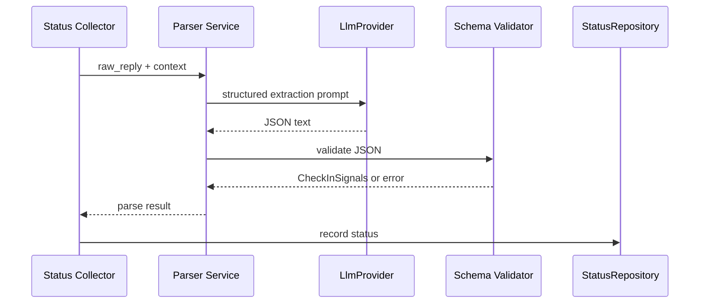

# Status Parsing LLD

## Scope

Status parsing converts a free-text developer reply into `CheckInSignals` and a `DeveloperStatus`. It extracts only what the developer stated or clearly implied. It does not reconcile against hard signals, score confidence, or predict risk.

## Structured Output

```json
{
  "progress_note": "Implemented payment retry tests",
  "blockers": ["Waiting for API credentials"],
  "eta_change_days": 1,
  "mood": "neutral"
}
```

Rules:

- `progress_note` is required for valid `CheckInSignals`.
- `blockers` defaults to an empty list.
- `eta_change_days` is an integer day delta or `null`.
- `mood` is `positive`, `neutral`, `negative`, or `null`.
- The parser must not invent blockers, dates, or completion claims.

## Prompt Contract

The parsing prompt is provider-neutral and sent through `LlmProvider`:

```text
Extract developer check-in signals from the reply.
Return only JSON matching the schema.
Do not infer work that is not stated in the reply.
Use null when ETA or mood is absent.
Use an empty blocker list when no blocker is stated.
```

The reply text is passed to the LLM call, status repository, and conversation store. Trace payloads retain submitted LLM input and output.

## Validation

Parsing uses a strict edge schema before constructing domain dataclasses:

- Reject non-object JSON.
- Trim empty strings.
- Cap blocker count and blocker length to prevent oversized records.
- Normalize unknown mood values to `None`.
- Reject non-integer ETA deltas.
- Preserve raw reply in `CheckIn.raw_reply` even when structured parsing fails.

## Fallbacks

- Valid JSON: record `CheckIn.signals` and `DeveloperStatus(source=CONFIRMED)`.
- Malformed JSON or schema failure: record the `CheckIn` with `signals=None`, then record `DeveloperStatus(source=CONFIRMED)` with summary `Reply received; parsing unavailable.`.
- Empty reply: keep the pending check-in open until the workflow timeout. Nudge handling owns `STALE`, `INFERRED`, and `UNKNOWN`.
- No reply after nudge: scheduling records `STALE`, `INFERRED`, or `UNKNOWN` based on available facts.

`StatusSource` is a source tag, not a confidence score.

## Status Mapping

```python
DeveloperStatus(
    tenant_id=checkin.tenant_id,
    developer_id=checkin.developer_id,
    as_of=checkin.replied_at.date(),
    source=StatusSource.CONFIRMED,
    blockers=signals.blockers,
    summary=signals.progress_note,
)
```

When parsing fails, `blockers=()` and the summary is the fallback text. This parser does not add persona API response fields.

## Sequence



## Persistence

Parsing stores results in:

- `checkins.raw_reply`: raw text, access controlled through authorization policy.
- `checkins.signals`: JSON representation of `CheckInSignals`, nullable.
- `developer_statuses`: derived summary, blockers, source, and as-of date.
- `facts`: append-only check-in fact with payload metadata and source reference.

## Tests

- Unit tests cover valid replies, no-blocker replies, multiple blockers, ETA changes, mood extraction, malformed JSON, oversized output, and empty replies.
- Property-style tests cover unexpected strings and ensure parser failures do not crash the collector.
- Tests assert raw replies are preserved for parsing/persistence and that persona contracts remain stable unless a route explicitly adds conversation fields.
