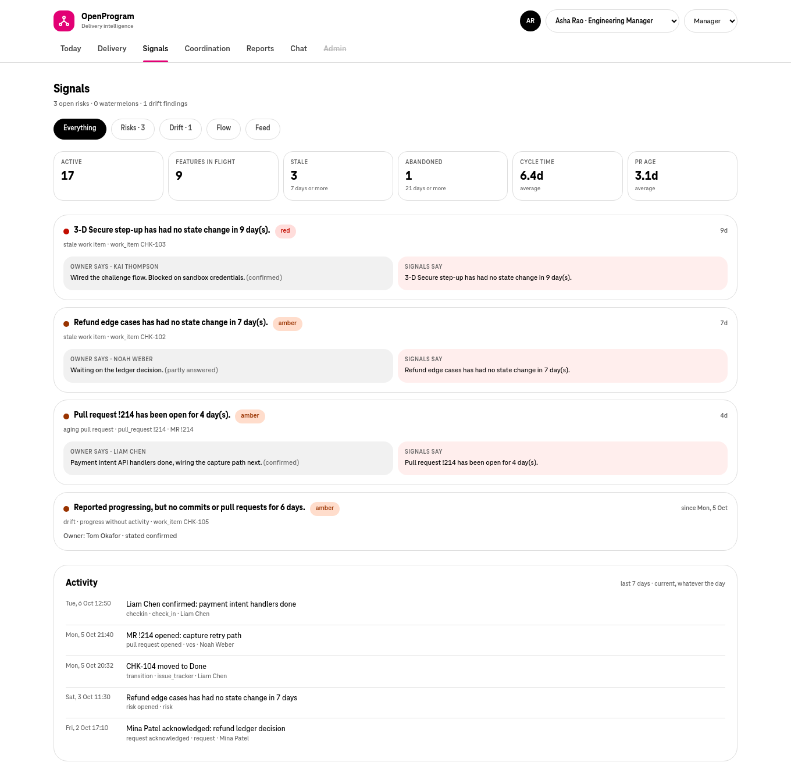
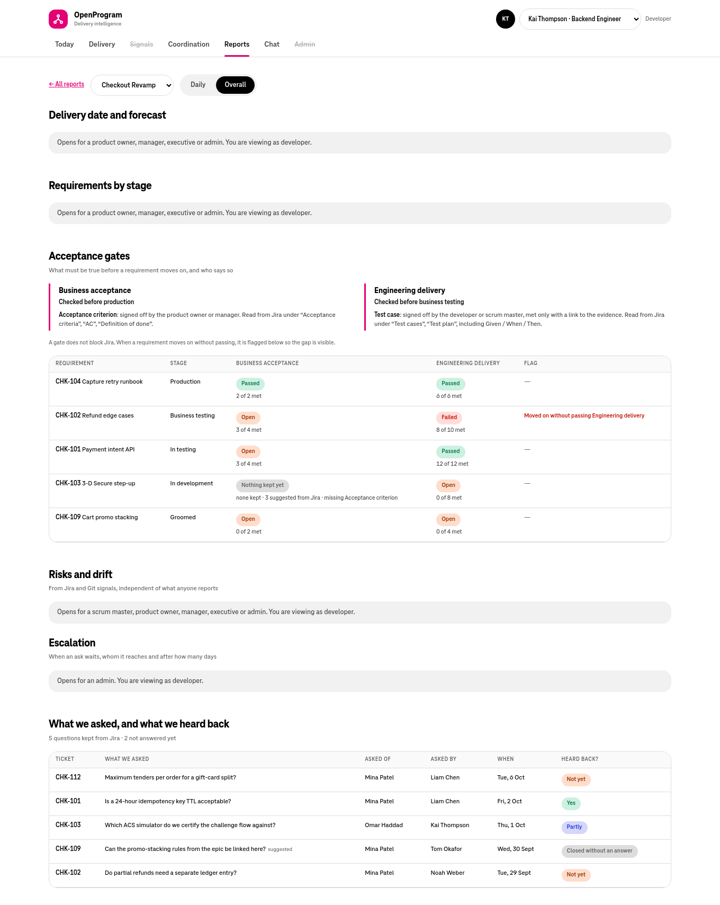

# frontend-v3: status and handoff

The single place to pick this work up in a new session: what is done, what is
left, how to resume, and what was decided along the way.

_Last updated: Tue 6 Oct 2026, 20:00 IST._

## Snapshot

|              |                                                                                                                                   |
| ------------ | --------------------------------------------------------------------------------------------------------------------------------- |
| Branch       | `feat/frontend-v3` in the main checkout `~/code/oneai/OpenProgram`                                            |
| Last commit  | `568a089` "wip(frontend-v3): project reports app with Projects, Daily and Overall views" (pushed to `origin/feat/frontend-v3`)    |
| Uncommitted  | **55 paths**: the whole console rebuild (every screen except the first Reports pass), 16 new screenshots, docs. Nothing is staged |
| Build health | lint, typecheck, prettier, **17/17 unit tests**, production build: all pass (last run 19:40)                                      |
| Rendered     | Every screen, per role, against the **mock API** only                                                                             |
| Real backend | First Reports pass was opened by you (Projects, Overall). **The rebuilt console has not been run against the backend yet**        |
| Size         | about 8,700 lines of TypeScript in `frontend-v3/src` (excluding the generated client), 5 test files                               |

**In one line:** every screen in the design exists and works against the mock;
the next step is to run it against the seeded backend, fix what differs, and
commit. Read-only views are complete; several write actions and most Admin
settings are still only in the frontend-v2 console.

## Resume in a new session

```bash
cd ~/code/oneai/OpenProgram
git status                         # expect 55 changed paths on feat/frontend-v3
docker compose up -d && make migrate
docker compose exec -w /app backend python -m scripts.seed_demo_history --reset
cd frontend-v3 && npm install && npm run dev      # http://127.0.0.1:5175
# without the backend:
npm run mock                                       # same URL, demo-shaped data
```

Read first: this file, then `frontend-v3/README.md` (routes, endpoints, checks).
Pick people in the header to switch role: Kai Thompson (developer), Ira Novak
(scrum master), Mina Patel (product owner), Asha Rao (manager; switch the lens
to admin), Elena Fischer (executive).

## Status by screen

Legend: **Done** = built, renders against the mock; **Partial** = built with a
named gap; **Not started** = not in v3 (the v2 console has it unless noted).

### Navigation and shell

| Item                                                                                          | Status      | Notes                                                                |
| --------------------------------------------------------------------------------------------- | ----------- | -------------------------------------------------------------------- |
| Top navigation on every screen (Today, Delivery, Signals, Coordination, Reports, Chat, Admin) | Done        | Underline on the active tab, scrolls sideways on phones              |
| Tabs a role isn't offered shown struck through                                                | Done        | Signals for developers, Admin for non-admins                         |
| Chat tab only when the backend serves the built-in chat                                       | Done        | From `auth/status.chat_enabled`                                      |
| Acting-as and lens pickers (local dev auth), name and Sign out (OIDC)                         | Done        | Same `localStorage` keys as frontend-v2                              |
| Sign-in and signed-out screens                                                                | Done        |                                                                      |
| Old `/projects/:id/...` links redirect to `/reports/...`                                      | Done        |                                                                      |
| Viewing a past day (`?asOf=`, banner, read-only)                                              | Not started | v2: `src/app/ViewingDateProvider.tsx`; most endpoints accept `as_of` |
| ⌘K command palette                                                                            | Not started | v2: `src/components/shell`                                           |
| Tenant logo in the header                                                                     | Not started | `GET /config/branding`                                               |
| Member's own check-in schedule (avatar menu)                                                  | Not started | `GET/PUT /me/checkin-preference`; v2: `src/features/checkin`         |

### Today

| Role                   | Item                                                                                        | Status  | Notes                                                                                                                                                                     |
| ---------------------- | ------------------------------------------------------------------------------------------- | ------- | ------------------------------------------------------------------------------------------------------------------------------------------------------------------------- |
| Developer              | Check-in card: summary, blockers with age, where the status came from                       | Partial | Source wording covers confirmed / partly / inferred / stale / none; "carried forward from an earlier day" is not distinguished                                            |
| Developer              | Confirm check-in                                                                            | Done    | `POST /me/status/confirm`                                                                                                                                                 |
| Developer              | Correct details: summary, ETA change, resolve blockers, add one                             | Done    | `POST /me/status/correct` with `blocker_items`                                                                                                                            |
| Developer              | Focus today, Your tasks                                                                     | Done    | `/me/focus`                                                                                                                                                               |
| Developer              | Waiting on you                                                                              | Done    | `/me/cross-person-requests?relation=waiting`                                                                                                                              |
| Developer              | Where you roll up (pod → project → program), "in no pod" message                            | Done    | From the directory                                                                                                                                                        |
| Scrum master           | Pod chips, defaulting to the person's pods                                                  | Done    | Under OIDC there is no acting-as id, so every pod is offered                                                                                                              |
| Scrum master           | Check-ins today, Open blockers oldest first, Why the pod is its colour, Waiting on you      | Done    | `/pods/{id}/checkins`, `/blockers`, `/rollup`                                                                                                                             |
| Product owner          | Project chips (projects of the person's pods)                                               | Done    |                                                                                                                                                                           |
| Product owner          | Progress ring and RAG counts, workstreams worst first, Needs your attention, Waiting on you | Done    | `/projects/{id}/progress`, `/projects/{id}/workstreams`                                                                                                                   |
| Manager / exec / admin | Verdict with reason and check-ins answered                                                  | Done    | `/portfolio/attention` (first program only)                                                                                                                               |
| Manager / exec / admin | 30-day momentum over reported days                                                          | Done    | `/persona/program/{id}/trend`                                                                                                                                             |
| Manager / exec / admin | Newest executive brief                                                                      | Done    | `/persona/briefs?kind=exec&limit=1`                                                                                                                                       |
| Manager / exec / admin | Portfolio heat (worst 4 per row, "worst N of M", tiles open Delivery)                       | Partial | Reasons under each tile and the "no pod" row of people in no team are missing (`/portfolio/heatmap` cells carry them; v2: `features/today/heatReasons.ts`, `noPodRow.ts`) |
| Manager / exec / admin | Oldest open risks                                                                           | Done    | `attention.signals`                                                                                                                                                       |

### Delivery

| Item                                                                                          | Status      | Notes                                                                                                                |
| --------------------------------------------------------------------------------------------- | ----------- | -------------------------------------------------------------------------------------------------------------------- |
| Navigator of programs, projects, workstreams, pods, worst first; selection in the URL         | Done        | `/delivery/:kind/:id`                                                                                                |
| Program panel: what sets the status, projects worst first with children, counts, every reason | Done        | `/programs/{id}/tree`; manager, exec, admin                                                                          |
| Project panel: reason, related nodes, progress ring, tasks, every reason, links to reports    | Done        | `/projects/{id}/progress`                                                                                            |
| Workstream panel: type, phase, target date, owner / TPM / SM, progress                        | Done        | metadata keys `type`, `phase`, `target_date`; people keys `owner_id`, `tpm_id`, `sm_id`                              |
| Pod panel: check-ins, blockers, reasons, tasks blocked first with owners and blockers         | Done        | `/pods/{id}/*`; scrum master, manager, admin                                                                         |
| Locked panels say which role opens them                                                       | Done        |                                                                                                                      |
| Pod delivery date (scrum master sets the pod's part)                                          | Not started | `GET /pods/{id}/delivery`, `PUT /projects/{p}/pods/{pod}/delivery-date`; v2: `features/forecast/PodDeliveryCard.tsx` |

### Signals

| Item                                                              | Status | Notes                                                  |
| ----------------------------------------------------------------- | ------ | ------------------------------------------------------ |
| Counts: open risks, watermelons, drift                            | Done   |                                                        |
| Filter Everything / Risks / Drift / Flow / Feed, kept in the URL  | Done   | `?view=`                                               |
| Risk cards: owner says beside signals say, age, links to Delivery | Done   | `/portfolio/risks`                                     |
| Drift cards                                                       | Done   | Owner shows as a member id where the API gives no name |
| Flow KPIs and per-workstream table                                | Done   | `/portfolio/flow`                                      |
| 7-day activity feed                                               | Done   | `/portfolio/feed`                                      |

### Coordination

| Item                                                                                             | Status | Notes                                                                    |
| ------------------------------------------------------------------------------------------------ | ------ | ------------------------------------------------------------------------ |
| Requests board: Open, Acknowledged, Needs resolution; Acknowledge and Resolve; DM delivery state | Done   | `/portfolio/cross-person-requests`, `/cross-person-requests/{id}/status` |
| Waiting on you, Raised by you                                                                    | Done   | `/me/cross-person-requests?relation=`                                    |
| Briefs with All / Exec / Weekly project / Daily pod filter in the URL                            | Done   | `?brief=`                                                                |
| Ask the graph with sources; explanation for developers                                           | Done   | `POST /ask`                                                              |

### Reports

| Item                                                                                                      | Status           | Notes                                                                                       |
| --------------------------------------------------------------------------------------------------------- | ---------------- | ------------------------------------------------------------------------------------------- |
| Reports home: every project, worst first, with Daily and Overall buttons                                  | Done             |                                                                                             |
| Set up a day report (project, release, name, time, time zone, days, destinations, on/off)                 | Done             | `GET /day-reports/setup`, `POST /day-reports`; unconnected destinations show why            |
| Change and remove a report                                                                                | Done             | `PUT`, `DELETE /day-reports/{id}`                                                           |
| Daily: schedule, audience, last send, Send now with confirm, today's note                                 | Done             | per-report `can_send`, `can_edit`, `can_write_note`                                         |
| Daily: the report preview, sections in the backend's order and words                                      | Done             | `/day-reports/{id}/preview`                                                                 |
| Daily: past sends with every destination's outcome                                                        | Done             | `/day-reports/{id}/runs`                                                                    |
| Overall: verdict, reasons, committed date and how it moved, the two forecast answers                      | Done             | `/projects/{id}/delivery`                                                                   |
| Overall: burn-down                                                                                        | Partial          | By requirement count. Story points need the daily snapshot to store points (backend change) |
| Overall: pods and releases with "Nothing in scope" when they hold no requirements                         | Done             | Fix for your first run                                                                      |
| Overall: requirements by stage, 30-day timeline, moves, requirement table                                 | Done             | `/projects/{id}/requirements?days=30`                                                       |
| Overall: acceptance gates in plain words, each requirement against each gate, flags                       | Done (read only) | `/projects/{id}/gates`                                                                      |
| Overall: risks and drift, escalation matrix, questions log                                                | Done (read only) | escalation needs admin; ids shown where the API gives no names                              |
| Set the project delivery date (product owner, manager)                                                    | Not started      | `PUT /projects/{id}/delivery-date`; v2: `features/forecast/DeliveryForecastCard.tsx`        |
| Gate actions: keep or dismiss suggestions, mark met / failed / waived, sign off, add an item, rescan Jira | Not started      | `/gate-items/{id}/confirm                                                                   | dismiss | sign-off`, `POST /issues/{key}/gate-items`, `POST /projects/{id}/gates/scan`; v2: `features/gates/` |
| Question status (answered, partly, closed) and adding a question                                          | Not started      | `PUT /questions/{id}`, `POST /issues/{key}/questions`                                       |
| Release scope on Overall (pick a release)                                                                 | Not started      | `requirements` and `gates` accept `release_id`; releases via `/projects/{id}/releases`      |
| Create a release from a Jira fix version or label                                                         | Not started      | `/projects/{id}/release-candidates`, `POST /projects/{id}/releases`                         |

### Chat

| Item                                                                                  | Status  | Notes                                                                                                                    |
| ------------------------------------------------------------------------------------- | ------- | ------------------------------------------------------------------------------------------------------------------------ |
| Own thread: bot questions, follow-ups, nudges, replies; refreshes every 5 s           | Done    | `/test/chat-simulator/messages?user_id=`                                                                                 |
| Composer files the reply against the open check-in                                    | Done    | `POST /test/chat-simulator/users/{id}/messages`                                                                          |
| Reply in thread to a request DM                                                       | Done    | same call with `thread_id`                                                                                               |
| Admin: roster, open anyone's thread, Ask for a check-in, Clear history (with confirm) | Done    | `/admin/workflows/checkin/dispatch`, `DELETE /test/chat-simulator/state`                                                 |
| Message purpose labels                                                                | Partial | `cross_person_request` is confirmed; `checkin`, `followup`, `nudge` are assumed names, so check them on the real backend |

### Admin

| Tab                                                                                                                                    | Status      | Notes                                                                                                                  |
| -------------------------------------------------------------------------------------------------------------------------------------- | ----------- | ---------------------------------------------------------------------------------------------------------------------- |
| Check-ins: every member's days, time zone, nudge and give-up waits marked default or set, write-back consent, tenant write-back switch | Done        | `/config/checkin-preferences`, `/config/members`, `/config/members/{id}/writeback-consent`, `/config/tenant/writeback` |
| Check-ins: Change dialog (sends only changed fields; refuses no days)                                                                  | Done        | `PUT /config/members/{id}/checkin-preference`, `PUT …/writeback-consent`                                               |
| Check-ins: put a field back to the team default                                                                                        | Not started | needs the backend's reset semantics confirmed                                                                          |
| Data sources: health, schedule, last sync and attempt, errors, targets                                                                 | Done        | `/admin/ops/sync-status`                                                                                               |
| Data sources: run a Jira / Git / calendar sync now                                                                                     | Not started | `/admin/workflows/sync/{jira,github,calendar}` need project key, repo or user                                          |
| Entities: lists of programs, projects, workstreams, pods, members; add the first four                                                  | Partial     | No edit or delete; members come from the directory                                                                     |
| Links (program↔project, pod↔project/workstream, member↔pod, task assignment)                                                           | Not started | links to the console                                                                                                   |
| Directory (sync, import members), identity links, pod escalation contacts                                                              | Not started | links to the console                                                                                                   |
| Delivery stages, Gates, Escalation matrix, Integrations, Branding                                                                      | Not started | links to the console                                                                                                   |

## Known risks when you run it for real

- **Never run against the backend:** Today, Delivery, Signals, Coordination,
  Chat, Admin, report set-up. The mock follows `generated.ts` exactly, so shapes
  match, but values may not: chat `purpose` names, request `kind` words,
  workstream metadata on your tenant, empty states on a fresh tenant.
- **Pod membership in the mock** includes the product owner and scrum master;
  the real seed may not, which changes the scrum master's default pod.
- **Under OIDC** there is no acting-as id, so the scrum master and product owner
  views offer every pod or project instead of the person's own.
- **Ids instead of names** in drift findings, the escalation matrix's decision
  owner and named levels, and request requesters outside the local roster.
- **Portfolio Today** reads only the first program.
- The admin consent column makes one request per member.

## Verification log

| Check                                                                           | Result                                                                                                                                                              |
| ------------------------------------------------------------------------------- | ------------------------------------------------------------------------------------------------------------------------------------------------------------------- |
| `npm ci` from the committed lockfile in a clean copy                            | ok                                                                                                                                                                  |
| `npm run lint`, `npm run typecheck`, `prettier --check .`                       | ok                                                                                                                                                                  |
| `npm test` (format, charts, report wording, delivery factors, admin wording)    | 17 / 17 pass                                                                                                                                                        |
| `npm run build`                                                                 | ok                                                                                                                                                                  |
| Every screen rendered per role, plus Overall as a developer and Today at 390 px | ok, fixes applied (duplicated wording on Waiting on you, faded "Check-in confirmed", Delivery navigator and Ask panel stretching, repeated evidence ids on Signals) |
| Real backend                                                                    | not yet for the rebuilt console                                                                                                                                     |
| Backend tests                                                                   | not run in the sandbox (no Python 3.12 or Docker); the backend is unchanged in this pass                                                                            |

## Remaining work, in order

1. **Run against the seeded backend** with each person above; note anything
   that differs from the mock. Fix, re-run `npm run lint && npm run typecheck &&
npm test && npm run build`.
2. **Commit and push** this pass on `feat/frontend-v3` (55 paths).
3. **Write actions in Reports:** set the project delivery date; gate item
   keep / dismiss / met / failed / waived / sign-off, add item, rescan; question
   status; release picker and release creation. Reference: frontend-v2
   `features/forecast/`, `features/gates/`, `features/requirements/`.
4. **Pod delivery date** for scrum masters (Delivery pod panel).
5. **Viewing a past day** across the app (`?asOf=`), then the ⌘K palette and the
   member's own check-in schedule.
6. **Today heat polish:** reasons under tiles and the "no pod" row.
7. **Admin tabs** now linking to the console: Links, Directory and identity
   links, escalation contacts, Delivery stages, Gates, Escalation, Integrations,
   Branding; edit and delete in Entities; sync-now buttons; reset to default.
8. **Names for ids** where the API gives none (map through `/config/members` for
   admins, or add names to the DTOs).
9. **Burn-down by story points** (backend: store points per stage in the daily
   snapshot, expose them on `RequirementTimelinePointResponse`).
10. Optional: an end-to-end smoke test (Playwright) per role.

## Repo changes

Committed in `568a089`: the first `frontend-v3` (Projects, Daily, Overall), CORS
port 5175 in `backend/config/settings.py`, `.env.example` and the
`docker-compose.yml` fallback, Makefile `frontend-v3-*` targets in `verify` and
`openapi-check`, a CI job on Node 22, README rows.

Uncommitted (this pass), all inside `frontend-v3/` except two docs:

- New: `src/app/{directory,nav}.ts`, `src/lib/words.ts`, `src/components/ui/Bits.tsx`,
  `src/features/{today,delivery,reports,admin}/`, `src/pages/{Today,Delivery,Signals,Coordination,Chat,Admin}Page.tsx`,
  `scripts/mock-console.mjs`, 16 screenshots.
- Changed: `App.tsx` (routes), `app/Layout.tsx` (navigation), `app/role.ts` and
  `RoleProvider.tsx` (capabilities), `api/client.ts` and `schema.ts` (copied whole
  from frontend-v2), Daily / Overall pages (reports header, set-up, fixes),
  `scripts/mock-api.mjs`, `scripts/screenshots.json`, `README.md`.
- Renamed: `pages/ProjectsPage.tsx` → `pages/ReportsHomePage.tsx`.
- Removed: the six first-pass screenshots.
- Repo root: `README.md` (frontend-v3 wording), this file.

## Code map (`frontend-v3/src/`)

| Path                                                                     | Purpose                                                                                                                                                                      |
| ------------------------------------------------------------------------ | ---------------------------------------------------------------------------------------------------------------------------------------------------------------------------- |
| `App.tsx`                                                                | Routes, auth gate, lazy pages                                                                                                                                                |
| `app/Layout.tsx`, `app/nav.ts`                                           | Header, the seven destinations with role gating, identity pickers                                                                                                            |
| `app/role.ts`, `app/RoleProvider.tsx`                                    | Identity and capability flags (`canReadProjectProgress`, `canReadAggregate`, `canReadPodDetail`, `canReadPortfolio`, `canSetUpDayReports`, `canManageConfig`, `chatEnabled`) |
| `app/directory.ts`                                                       | Directory queries, `useNames()`, `podsOf` / `projectsOf`                                                                                                                     |
| `api/client.ts`, `api/schema.ts`, `api/generated.ts`                     | Every endpoint, typed (copied from frontend-v2)                                                                                                                              |
| `components/ui/Bits.tsx`                                                 | `RagDot`, `RagBadge`, `Greeting`, `ChipPicker`, `ProgressRing`, `Sparkline`, `Row`, `Panel`                                                                                  |
| `components/PanelState.tsx`, `Dialogs.tsx`, `ui/{Card,Pill,RagChip}.tsx` | Loading / locked / 403 / error / empty states, tables, dialogs                                                                                                               |
| `pages/`                                                                 | One file per destination; `TodayPage` switches by role                                                                                                                       |
| `features/today/`                                                        | `DeveloperToday`, `ScrumMasterToday`, `ProductOwnerToday`, `PortfolioToday`, `WaitingOnYou`                                                                                  |
| `features/delivery/`                                                     | `ProgramPanel`, `ProjectPanel`, `WorkstreamPanel`, `PodPanel`, `ProgressBlock`, `NodeBits`, `factors.ts` (+ test)                                                            |
| `features/reports/`                                                      | `ReportsHeader`, `ReportSetupDialog`                                                                                                                                         |
| `features/daily/`, `features/overall/`                                   | Daily header, preview, past sends; Overall sections and charts (+ tests)                                                                                                     |
| `features/admin/`                                                        | `CheckinsTab`, `DataSourcesTab`, `EntitiesTab`, `adminWords.ts` (+ test)                                                                                                     |
| `lib/`                                                                   | `format.ts` (+ test), `status.ts`, `words.ts`, `utils.ts`                                                                                                                    |
| `../scripts/`                                                            | `mock-api.mjs` + `mock-console.mjs` (`npm run mock`), `screenshots.py` + `screenshots.json`                                                                                  |

## Screenshots

Mock data, not the live backend; times are in the sandbox's time zone.

|                                                                                                           |                                                                                                                        |
| --------------------------------------------------------------------------------------------------------- | ---------------------------------------------------------------------------------------------------------------------- |
|  **Today, developer**             |  **Today, scrum master**                 |
|  **Today, product owner** |  **Today, manager**                                |
|  **Delivery, pod**                      |  **Delivery, program (executive)** |
|  **Signals**                                       |  **Coordination**                                     |
|  **Reports**                                       |  **Daily**                                                  |
|  **Overall (admin)**                  |  **Overall (developer, locked panels)**    |
|  **Chat**                                      |  **Admin, check-ins**                           |
|  **Admin, data sources**    |  **Today at 390 px**                              |

## How we got here

1. **Design page** (<https://claude.ai/artifact/5vRcnsnsPHE6oRunvXYaJY>, private,
   "OpenProgram by Role"): the product shown through its six roles, with a
   console mock per role and an access matrix. This build follows it.
2. **Reports asked for:** an end-of-day report for action, a forecast with
   burn-down and completion, risks with who resolves them, dependencies and
   escalation, and an AIDLC requirements view with business acceptance and test
   cases. Then restructured: AIDLC folded into **Overall**, two views **Daily** and
   **Overall**, gates explained in plain words; your sample daily report set the
   shape of Daily.
3. **Separate UI** on the same backend: first pass (Reports only) committed as
   `568a089`.
4. **Your run against the backend** showed no navigation and none of the role
   screens. You chose to **build fresh from the design** and **everything in the
   design**, then to keep building and test once all is done. That is where this
   stands.

## Notes for the agent in the next session

- Work in the main checkout; the earlier worktree is gone. The sandbox mounts it
  at `/sessions/<session>/mnt/OpenProgram`, and plain `git` works there.
- Deleting files needs `allow_cowork_file_delete` first. A git command that
  deletes and fails halfway can leave `.git/index.lock`; check before git work.
- Never `npm install` inside the repo from the Linux sandbox (Linux binaries in
  the Mac's `node_modules`). Copy `frontend-v3/` to a work folder without
  `node_modules` and `dist`, install and check there, copy sources back.
- The sandbox has Node 22.23, no Python 3.12, no Docker: frontend checks only.
- Screenshots: `pip install PySide6==6.8.0.2` gives QtWebEngine; it needs the
  stub and symlinked libraries described in `frontend-v3/scripts/screenshots.py`.
  Build with `VITE_API_BASE_URL=`, start `node scripts/mock-api.mjs` and the
  shooter in the same shell call, and stop the mock by its PID.
- The mock lives in `scripts/mock-api.mjs` (reports) and `scripts/mock-console.mjs`
  (everything else); extend both when a screen gains an endpoint.
