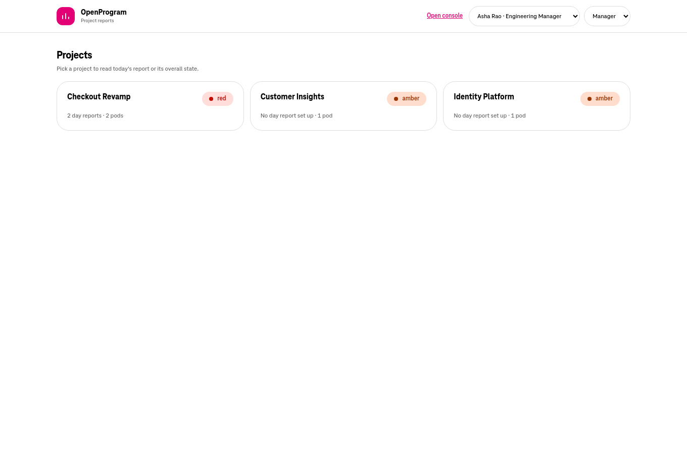
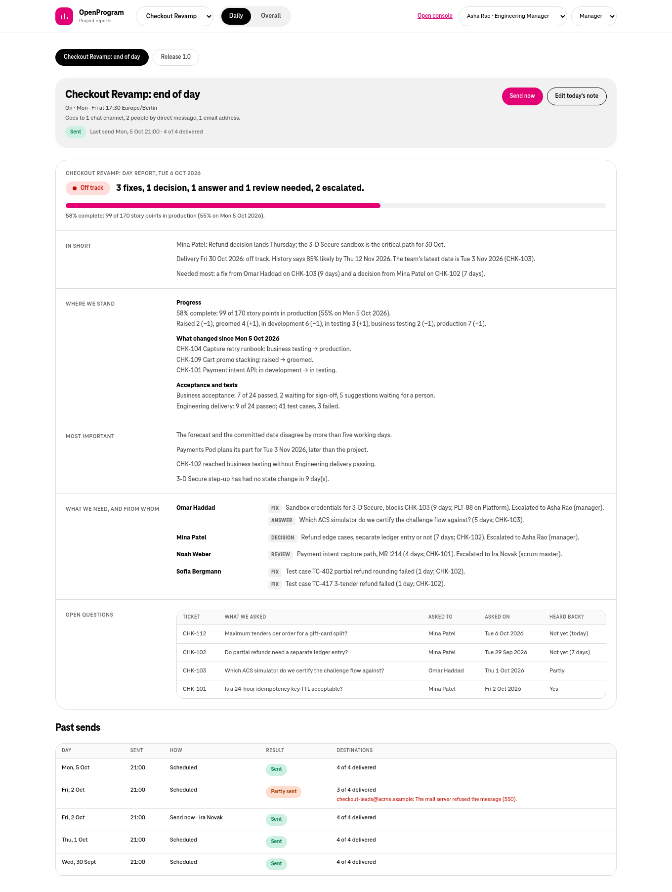
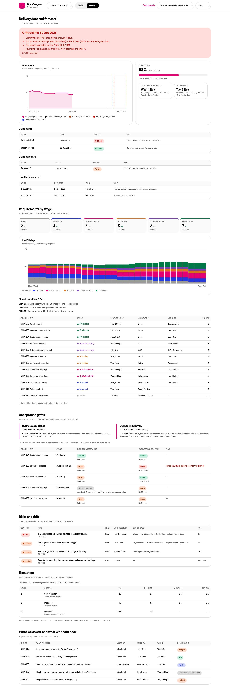
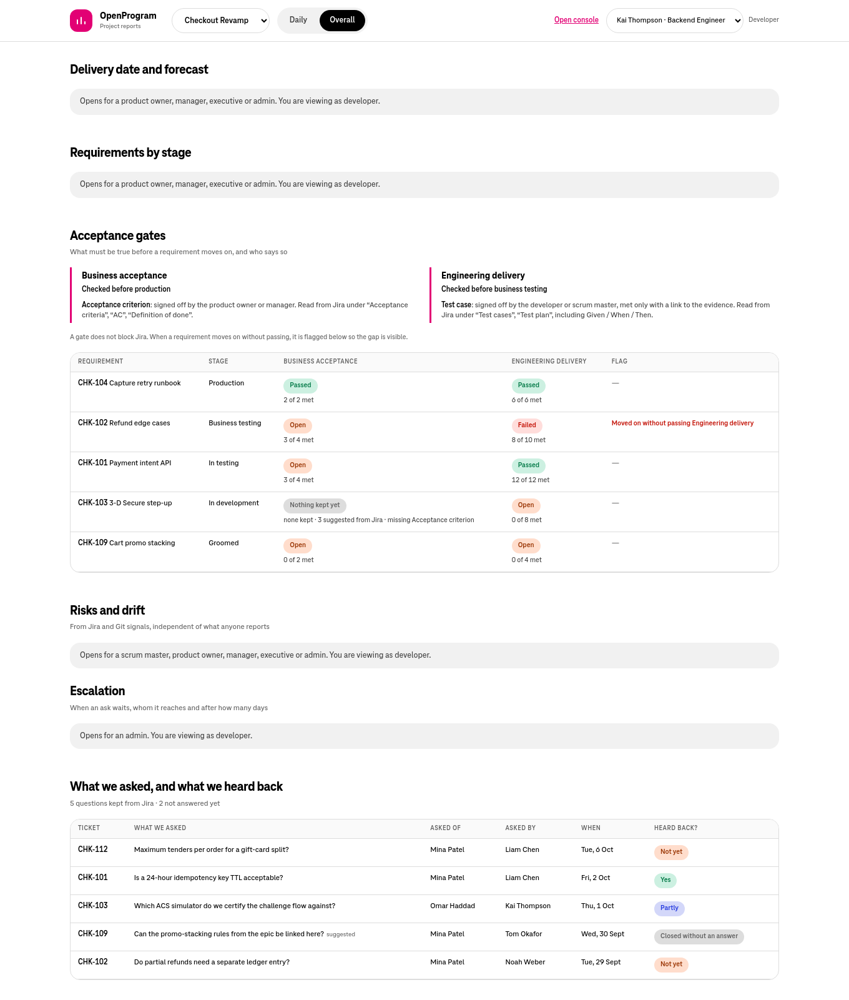
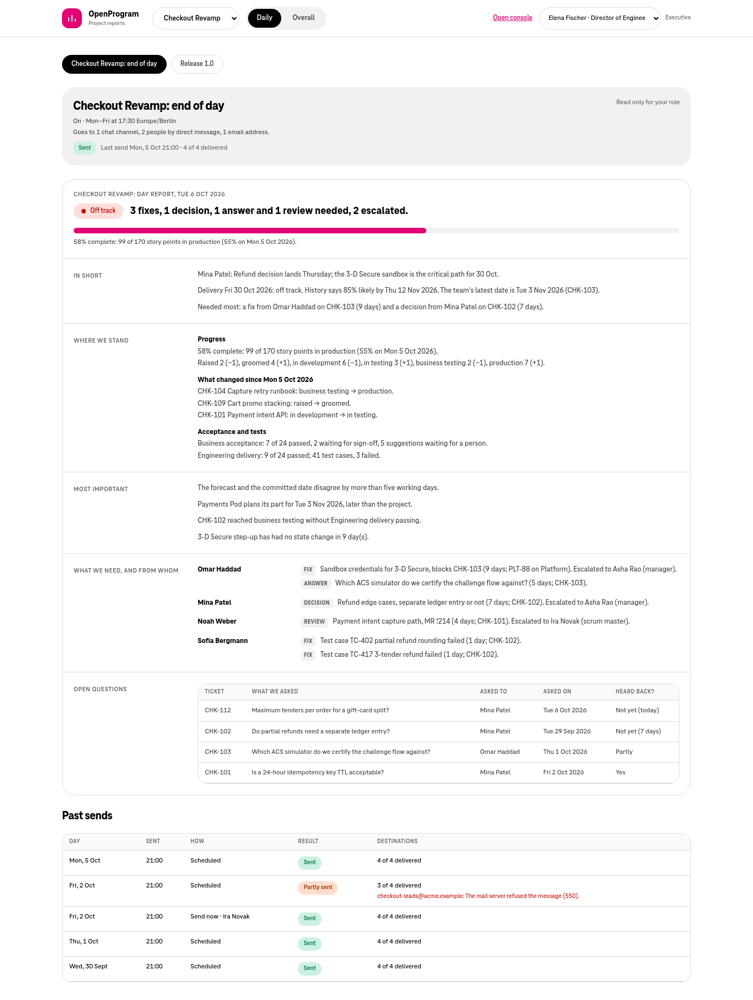
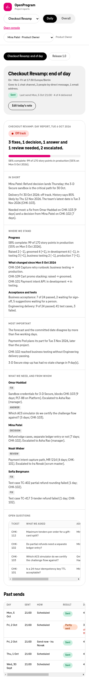

# frontend-v3: project reports app (handoff)

Everything needed to pick this work up in a new session: where the code is,
what was decided and why, what was built, what was checked, and what is next.

_Last updated: Tue 6 Oct 2026, 15:45 IST._

## Status at a glance

| Item                                                                          | State                                                       |
| ----------------------------------------------------------------------------- | ----------------------------------------------------------- |
| App scaffolded (`frontend-v3/`, port 5175)                                    | Done: Projects, Daily and Overall views on the real API     |
| Repo wiring (CORS, Makefile, `openapi-check`, CI, README)                     | Done                                                        |
| Static checks (lint, typecheck, prettier, 13 unit tests, build, client regen) | All pass                                                    |
| Rendered in a browser                                                         | Yes, against a **mock API** (screenshots below)             |
| Run against the real backend                                                  | **Not yet**. First thing to do next                         |
| Backend tests after the CORS default change                                   | **Not run** (no Python 3.12 or Docker in the agent sandbox) |
| Committed / pushed                                                            | **No**. All changes are uncommitted on `feat/frontend-v3`   |

## Where everything is

| What                                      | Where                                                                                                                                                    |
| ----------------------------------------- | -------------------------------------------------------------------------------------------------------------------------------------------------------- |
| Repository                                | `~/code/oneai/OpenProgram` · remote `https://github.com/bharatnpti/OpenProgram`                                                      |
| Working copy for this work                | `~/code/oneai/OpenProgram/.claude/worktrees/delivery-reporting` (a git worktree; the folder name is historical)                      |
| Branch                                    | `feat/frontend-v3`, created from `origin/main` at `2c60090` ("feat(workstreams): make workstreams optional…", 6 Oct 14:57) with `--no-track`             |
| This file                                 | `frontend-v3.md` at the root of that worktree                                                                                                            |
| App                                       | `frontend-v3/` in that worktree                                                                                                                          |
| Screenshots                               | `frontend-v3/docs/screenshots/*.png`                                                                                                                     |
| Mock design page (earlier in the session) | <https://claude.ai/artifact/5vRcnsnsPHE6oRunvXYaJY> ("OpenProgram by Role", private, version 3: role switcher, Daily/Overall report mock, access matrix) |

Git state worth knowing:

- `feat/delivery-reporting` (`23d3341`) still exists, unchanged. Every one of its
  commits is already in `origin/main` (rebased; the last one is `0b82421`), which
  is why the new branch starts from `origin/main`.
- The **main checkout** (`~/code/oneai/OpenProgram`, branch
  `main` at `8c6c86f`) is **13 commits behind `origin/main`** and has your own
  uncommitted work. It was not touched: `backend/api/routers/config.py`,
  `backend/config/settings.py`, `backend/infra/workflows/checkin_fanout.py`,
  `backend/infra/workflows/daily_checkin.py`, `backend/tests/unit/test_api.py`,
  `frontend-v2/package-lock.json`, plus untracked
  `backend/tests/unit/test_demo_rounds_reset.py` and `features_usefulness.md`.
  `settings.py` is changed on both sides, so expect to merge `cors_origins` by hand.

Local URLs once running:

| Service                          | URL                                                    |
| -------------------------------- | ------------------------------------------------------ |
| API                              | <http://127.0.0.1:8000> (`/health`, `/ready`, `/docs`) |
| Original console (`frontend/`)   | <http://127.0.0.1:5173>                                |
| Console (`frontend-v2/`)         | <http://127.0.0.1:5174> (Reports page: `/reports`)     |
| **Reports app (`frontend-v3/`)** | <http://127.0.0.1:5175>                                |

Demo videos of the product (English and Hindi) are linked from the root
`README.md` under "Demo videos" (GitHub release `demo-videos-2026-10`).

## How we got here

The conversation went in this order; the decisions in bold shaped the app.

1. **Explainer page.** Read `README.md`, `OpenProgramConcept.md`, `features.md`
   and the demo roster, then published a page that shows the product through its
   six roles (developer, scrum master, product owner, manager, executive, admin),
   with the console's own magenta palette and RAG tokens. That is the artifact
   linked above.
2. **Reports asked for.** An end-of-day report for action (a distribution list of
   people); the project's state with forecasting ("is the delivery date
   possible?") as a burn-down and completion bar; risks with who resolves them,
   dependencies and an escalation path per person; and an "AIDLC update"
   requirements view (counts raised, groomed, in development, in testing,
   business testing, production, over time), the business acceptance gate
   (criteria business users set per Jira ticket) and engineering delivery (test
   cases).
3. **Restructured.** **AIDLC is not its own tab; it belongs in Overall.**
   **A report has two views: Daily and Overall.** **The two gates are explained in
   plain words** (business acceptance = criteria business writes on each ticket,
   checked before production; engineering delivery = test cases with evidence,
   checked before business testing) and shown side by side per requirement.
4. **Reference format for Daily** (your sample, used as the shape, not copied):
   an "In short" with counts, how the questions to Product stand, what matters
   most and one clear ask; "Where we stand" as a table comparing two dates with a
   line explaining why a number moved; "Most important" as ticket + needs a fix
   or a decision + the evidence; "What we need, and from whom" grouped by owner;
   "What we asked, and what we heard back" with Yes / Partly / Not yet / Closed.
   The backend's day report builder already follows this order.
5. **Separate UI.** Decided to build it as a new app, `frontend-v3`, on the same
   backend. The backend already serves everything (features.md §4.26–4.30 on
   main: requirements by stage, day reports, delivery dates and forecast,
   acceptance gates and questions, escalation matrix), and frontend-v2 already
   has a Reports page. A third app means a third client in the drift gate; that
   trade-off was accepted.
6. **Scaffolded, wired, checked, screenshotted** (this file).

## What the app does

Routes are project-first, so every view can be linked:

| Path                           | View                                                                                          |
| ------------------------------ | --------------------------------------------------------------------------------------------- |
| `/`                            | Projects, worst status first, with how many day reports each has                              |
| `/projects/:projectId/daily`   | Daily report. `?report=` picks one when a project has several (whole project, or one release) |
| `/projects/:projectId/overall` | Overall state                                                                                 |

**Daily** reads `GET /day-reports?project_id=` and, for the selected report,
`/day-reports/{id}/preview` and `/day-reports/{id}/runs`. The preview is today's
report built live by the backend exactly as it would be sent; the app only lays
out its sections (lines, groups, table). The asks section splits each line's
kind ("Fix: …") into a tag. Send now (with a confirm step that names how many
destinations receive it) and Write today's note appear only when the report
says `can_send` / `can_write_note` for this reader. Past sends show how every
destination fared.

**Overall** is five independent reads, so one refused or slow read never blanks
the others:

1. Delivery date and forecast (`/projects/{id}/delivery`): verdict and reasons,
   committed date and how it moved, the two answers side by side (completion-rate
   simulation 50%/85% vs the team's own dates), dates by pod and by release, the
   date change log, and a **burn-down by count** drawn from the requirements
   timeline with the committed, 50%, 85% and team dates marked.
2. Requirements by stage (`/projects/{id}/requirements?days=30`): six stage
   counts with change since the previous snapshot, a 30-day stacked timeline,
   what moved, and every requirement with stage, since when, Jira status,
   assignee and points.
3. Acceptance gates (`/projects/{id}/gates`): each gate's plain-language
   definition from its template (what it checks, before which stage, who signs
   off, whether evidence is needed, which Jira headings it reads), then each
   requirement against each gate, flagging ones that moved on without passing.
4. Risks and drift (`/projects/{id}/risks`) and the escalation matrix
   (`/config/escalation/projects/{id}`).
5. Questions kept from Jira (from the gates response): what was asked, of whom,
   by whom, when, heard back.

Who sees what (the app mirrors the backend only to say up front which role
opens a panel; the backend still decides, and every panel also handles a 403):

| Panel                                             | Readers                                                                           |
| ------------------------------------------------- | --------------------------------------------------------------------------------- |
| Daily report, past sends                          | everyone                                                                          |
| Send now                                          | scrum master (projects their pods work on), manager, admin, per report `can_send` |
| Today's note                                      | product owner, manager, admin, per report `can_write_note`                        |
| Delivery date and forecast, requirements by stage | product owner, manager, executive, admin                                          |
| Acceptance gates, questions                       | everyone (project-progress read or gate editing)                                  |
| Risks and drift                                   | everyone but the developer                                                        |
| Escalation matrix                                 | admin only (`MANAGE_CONFIG`)                                                      |

Identity works like the console: on a local dev-auth tenant the header has the
acting-as picker and a lens picker, sharing the console's `localStorage` keys
(`openprogram.acting-as`, `openprogram.active-role`); under OIDC the token
decides and only the name and Sign out remain.

## Screenshots

Taken with headless Chromium (QtWebEngine) against `frontend-v3/scripts/mock-api.mjs`,
which serves demo-shaped data for Checkout Revamp. **These are not real data and
not the live backend**; they show layout, roles and states.

**Projects** (Asha Rao as manager)



**Daily** (Asha Rao as manager: Send now and Edit today's note are offered)



**Overall** (Asha Rao as admin: every panel, including the escalation matrix)



**Overall** (Kai Thompson as developer: forecast, requirements, risks and
escalation say which role opens them; gates and questions show)



**Daily** (Elena Fischer as executive: read only)



**Daily on a phone** (390 px wide, Mina Patel as product owner: tables scroll
inside their own box, the page never scrolls sideways)



## Code map (`frontend-v3/`)

| Path                                                | Purpose                                                                                                                                                                                                                        |
| --------------------------------------------------- | ------------------------------------------------------------------------------------------------------------------------------------------------------------------------------------------------------------------------------ |
| `package.json`, `package-lock.json`                 | Same toolchain as frontend-v2 (React 19, Vite 8, TypeScript, Tailwind 4, TanStack Query, react-router 7, Radix dialogs, sonner). Lockfile pruned from frontend-v2's, every package at the same version; form libraries dropped |
| `vite.config.ts`                                    | Port 5175, `strictPort` (a drifted port would be blocked by CORS)                                                                                                                                                              |
| `eslint.config.js`, `.prettierrc`, `tsconfig*.json` | Copied from frontend-v2; `scripts/` is ignored by eslint                                                                                                                                                                       |
| `public/favicon.svg`                                | Icon, copied from frontend-v2                                                                                                                                                                                                  |
| `src/index.css`                                     | frontend-v2's tokens plus six `--op-stage-*` colours, one per delivery stage                                                                                                                                                   |
| `src/api/openapi.json`, `generated.ts`              | Same schema and generated types as the other clients; regenerated by `make openapi-check`                                                                                                                                      |
| `src/api/schema.ts`                                 | Type aliases for what the app uses                                                                                                                                                                                             |
| `src/api/client.ts`                                 | Trimmed port of frontend-v2's client: cookies, CSRF on writes, dev acting-as headers, correlation id; only the endpoints the app calls                                                                                         |
| `src/app/role.ts`, `RoleProvider.tsx`               | Trimmed port of frontend-v2's identity rules (who the API is told you are, cache dropped on switch); capability flags `canReadProjectProgress`, `canReadAggregate`, `canManageConfig`                                          |
| `src/app/Layout.tsx`                                | Header: project picker, Daily/Overall tabs, Open console link, acting-as and lens pickers or name and Sign out                                                                                                                 |
| `src/App.tsx`, `src/main.tsx`                       | Routes, auth gate, query client (no retry on 401/403/404)                                                                                                                                                                      |
| `src/components/PanelState.tsx`                     | Loading, locked ("Opens for …"), 403 with the server's reason, error with retry, empty; table styles                                                                                                                           |
| `src/components/Dialogs.tsx`                        | Confirm (Send now) and text (today's note) dialogs                                                                                                                                                                             |
| `src/components/ui/`                                | `Card`, `Pill`, `RagChip` copied from frontend-v2                                                                                                                                                                              |
| `src/pages/`                                        | `ProjectsPage`, `DailyPage`, `OverallPage`                                                                                                                                                                                     |
| `src/features/daily/`                               | `ReportHeader` (schedule, audience, last send, actions), `ReportPreview` (sections), `RunHistory`, `reportView.ts` (+ test)                                                                                                    |
| `src/features/overall/`                             | `ForecastSection`, `Burndown`, `RequirementsSection`, `GatesSection`, `RisksSection`, `QuestionsSection`, `queries.ts` (one hook per endpoint, `enabled` by role), `charts.ts` (+ test: burn-down and stacked-bar geometry)    |
| `src/lib/`                                          | `format.ts` (+ test), `status.ts` (tones, verdict and stage labels, stage order and colours), `utils.ts`                                                                                                                       |
| `scripts/mock-api.mjs`                              | Mock API + static server for `npm run mock` and the screenshots                                                                                                                                                                |
| `scripts/screenshots.py`, `screenshots.json`        | QtWebEngine screenshot runner and the six shots                                                                                                                                                                                |
| `docs/screenshots/`                                 | The PNGs above (about 1.5 MB)                                                                                                                                                                                                  |
| `README.md`                                         | How to run, routes, who sees what, gaps, checks                                                                                                                                                                                |

## Changes outside `frontend-v3/`

| File                         | Change                                                                                                                                                                                                                                                                 |
| ---------------------------- | ---------------------------------------------------------------------------------------------------------------------------------------------------------------------------------------------------------------------------------------------------------------------- |
| `backend/config/settings.py` | `cors_origins` default adds `http://localhost:5175` and `http://127.0.0.1:5175`                                                                                                                                                                                        |
| `.env.example`               | `OPENPROGRAM_CORS_ORIGINS` adds the two 5175 origins                                                                                                                                                                                                                   |
| `docker-compose.yml`         | The `OPENPROGRAM_CORS_ORIGINS` fallback (used only when `.env` doesn't set it) now lists 5173, **5174** and 5175; it was missing 5174 before                                                                                                                           |
| `Makefile`                   | New targets `frontend-v3-install`, `-dev`, `-lint`, `-format`, `-build`, `-test`; `verify` runs `frontend-v3-lint` and `frontend-v3-build`; `openapi-check` copies the schema into frontend-v3, regenerates its client and includes both files in the drift `git diff` |
| `.github/workflows/ci.yml`   | New `frontend-v3` job on **Node 22** (lint, typecheck, format, `npm test`, build); `api-contract` installs frontend-v3 too; `image` needs `frontend-v3`                                                                                                                |
| `README.md`                  | "three frontends", repo tree and map rows, how to run it, Make line, `openapi-check` wording                                                                                                                                                                           |

`npm test` is not in `make verify` because `node --test` on `.ts` files needs
Node 22.18+, and the README promises Node 20+ (frontend-v2's tests are not in
`verify` for the same reason). CI runs it.

## How to run

Against the real backend (from the worktree root):

```bash
cp .env.example .env            # or add the 5175 origins to your existing .env
docker compose up -d
make migrate
docker compose exec -w /app backend python -m scripts.seed_demo_history --reset
cd frontend-v3 && npm install && npm run dev
```

Then open <http://127.0.0.1:5175> and switch people in the header: Asha Rao
(manager and admin), Elena Fischer (executive), Mina Patel (product owner), Ira
Novak (scrum master), Kai Thompson (developer). The demo story: Checkout Revamp
is red (Payments blockers and one silent member), Identity amber on an aging
review, Customer Insights amber on a stale spike. Without a day report set up,
Daily says so and links to the console's Reports page to create one.

Without the backend: `cd frontend-v3 && npm run mock`, then open the same URL.

| Variable                            | Default                 | Purpose                                                                                  |
| ----------------------------------- | ----------------------- | ---------------------------------------------------------------------------------------- |
| `VITE_API_BASE_URL`                 | `http://127.0.0.1:8000` | Backend to call (empty = same origin, used by `npm run mock`)                            |
| `VITE_CONSOLE_URL`                  | `http://127.0.0.1:5174` | Where "Open console" and set-up links go                                                 |
| `OPENPROGRAM_CONSOLE_URL` (backend) | unset                   | Set to `http://127.0.0.1:5175` to make the report's "Open in OpenProgram" link land here |

## What was checked

Passed, from a clean copy installed with `npm ci` from the committed lockfile:

- `npm run lint`, `npm run typecheck`, `prettier --check .`
- `npm test`: 13 tests (formatting, burn-down by count, axis stretch so a future
  committed date stays on the chart, stacked bars, ask parsing, send
  confirmation wording, yesterday's note not prefilling today's)
- `npm run build`, and the same-origin mock build
- `openapi-check` equivalent: regenerating `generated.ts` from `openapi.json`
  gives no diff; `openapi.json` matches `frontend/`'s
- `ruff check` and `ruff format --check` on `backend/config/settings.py`;
  `docker-compose.yml` parses; `ci.yml` parses with the new job in `needs`
- No test asserts the default CORS list (checked `test_settings.py`,
  `test_api.py`, bdd fixtures)
- Rendered in headless Chromium against the mock API for five roles and a phone
  width; found and fixed: page widening on phones (grid tracks now
  `minmax(0,1fr)`), a duplicated date in the report eyebrow, an oversized
  timeline chart, "0 of 0 met" on gates, "1 pods"

Not checked yet:

- The app against the **real backend** and seeded demo data
- Backend `pytest` after the `cors_origins` change
- CI itself (nothing pushed)

## Next steps

1. **Commit and push**, then open a PR:
   ```bash
   cd ~/code/oneai/OpenProgram/.claude/worktrees/delivery-reporting
   git status        # make sure no .git/worktrees/delivery-reporting/index.lock is left
   git add -A && git commit -m "feat(frontend-v3): project reports app with Daily and Overall views"
   git push -u origin feat/frontend-v3
   ```
   Decide first whether `frontend-v3/docs/screenshots/` (1.5 MB of mock-data
   PNGs) and `frontend-v3/scripts/` belong in the repo.
2. **Run against the seeded demo** and check, per person: Daily renders the
   backend's preview for a report created in the console; Send now and the note
   work and respect `can_send` / `can_write_note`; Overall's five panels load or
   say which role opens them; numbers match the console's Reports and Delivery
   pages.
3. **Run the backend tests** on the Mac (`make test`, or at least
   `backend/tests/unit/test_settings.py` and `test_api.py`).
4. **Names instead of ids**: the escalation matrix shows `decision_owner_id` and
   a named level's `member_id` as ids, and drift findings show `owner_id`. Either
   map them through `/config/members` (admin reads the matrix anyway) or add
   names to the DTOs.
5. **Burn-down by story points**: the requirements timeline keeps counts per
   stage per day, not points. Needs the daily snapshot to store points per stage
   and `RequirementTimelinePointResponse` to carry them; then switch
   `burndownByCount` for a points version.
6. **Release scope on Overall**: `requirements` and `gates` accept `release_id`;
   add a release picker (Daily already picks release reports).
7. **Past-day viewing**: the console's `?asOf=` is not implemented in v3; the
   requirements, delivery, gates and risks endpoints accept `as_of`.
8. Open questions: does v3 need report set-up (create, schedule, destinations)
   or does that stay in the console? Add a Playwright smoke test? An aggregate
   Overall endpoint only if five requests prove slow.

## Backend endpoints used

| Endpoint                                                                            | Capability                              | Notes                                                                                             |
| ----------------------------------------------------------------------------------- | --------------------------------------- | ------------------------------------------------------------------------------------------------- |
| `GET /api/v1/auth/status`, `GET /api/v1/auth/dev-users`, `POST /api/v1/auth/logout` | none                                    | dev-users only when `demo_mode`                                                                   |
| `GET /projects`                                                                     | directory read                          | project picker and list                                                                           |
| `GET /day-reports?project_id=`                                                      | `READ_DAY_REPORTS` (everyone)           | returns `can_send`, `can_edit`, `can_write_note`, `audience_summary`, `last_run`, `note`          |
| `GET /day-reports/{id}/preview`                                                     | `READ_DAY_REPORTS`                      | `rag`, `headline`, `percent_complete`, `progress_line`, `sections[]` (`lines`, `groups`, `table`) |
| `GET /day-reports/{id}/runs`                                                        | `READ_DAY_REPORTS`                      | outcomes per destination                                                                          |
| `POST /day-reports/{id}/send`                                                       | `SEND_DAY_REPORTS` (per project)        | manual send, recorded with actor                                                                  |
| `PUT /day-reports/{id}/note`                                                        | `SET_PROJECT_DATES`                     | body `{ text }`; today's report only                                                              |
| `GET /projects/{id}/delivery`                                                       | `READ_PROJECT_PROGRESS`                 | `project`, `pods[]`, `releases[]` each with commitment, history (p50/p85), team, verdict, reasons |
| `GET /projects/{id}/requirements?days=30`                                           | `READ_PROJECT_PROGRESS`                 | stages with change, timeline of counts, moves, requirements                                       |
| `GET /projects/{id}/gates`                                                          | `READ_PROJECT_PROGRESS` or `EDIT_GATES` | templates, issues with evaluations and `passed_without` (gate **names**), questions               |
| `GET /projects/{id}/risks`                                                          | team or exec aggregate                  | risks (with `person_name`) and drift                                                              |
| `GET /config/escalation/projects/{id}`                                              | `MANAGE_CONFIG`                         | source, decision owner id, levels with `after_days` per fix/decision/answer/review                |

Backend sources for wording and rules: `backend/core/application/day_report_builder.py`,
`day_report_asks.py`, `gate_service.py`, `backend/core/domain/gates.py`
(default gates), `backend/api/dtos.py`, and `features.md` §4.26–4.30.

## Notes for the agent in the next session

- The worktree's `.git` file points at a Mac path, so from the Linux sandbox run
  git as `git --git-dir=.git/worktrees/delivery-reporting --work-tree=.claude/worktrees/delivery-reporting …`
  from the main repo folder. **Never** run `git worktree add` or `prune` from the
  sandbox: it would write Linux paths into the worktree metadata (the worktrees
  already look "prunable" from there).
- The sandbox cannot delete files in the folder until `allow_cowork_file_delete`
  is granted. A git command that needs to delete (switch, checkout) fails halfway
  and leaves `index.lock`; it happened once here and was removed.
- Do not `npm install` inside the repo from the sandbox (Linux binaries would land
  in a Mac folder). Copy to a work folder, install and build there, and copy
  sources back without `node_modules` or `dist`.
- The sandbox has no Python 3.12 and no Docker, so backend tests and the stack
  cannot run there. Its Node is 22.23 (runs `npm test`).
- Screenshots: `pip install PySide6==6.8.0.2` gives QtWebEngine on aarch64; it
  needs the stub and symlinked libraries described at the top of
  `frontend-v3/scripts/screenshots.py`. Start the mock server and the shooter in
  the **same** shell call (background processes end with the call), and don't
  `pkill -f` a pattern that also matches your own command line.
- The published artifact cannot be opened in the in-app browser (it is not
  signed in to claude.ai); open it in your own browser.
